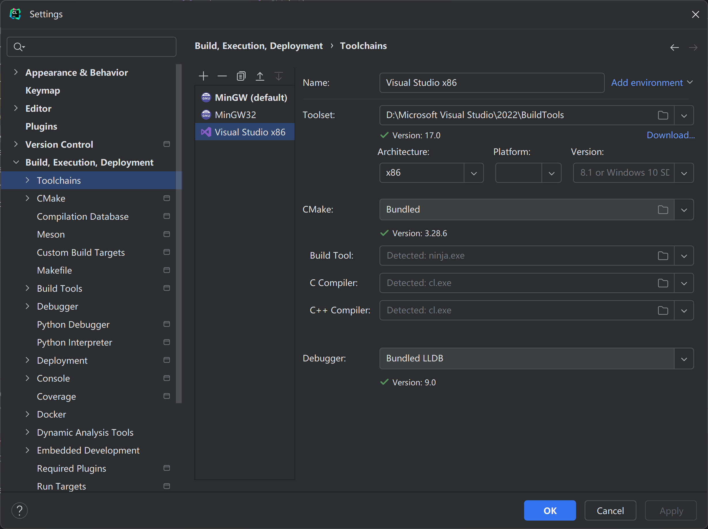
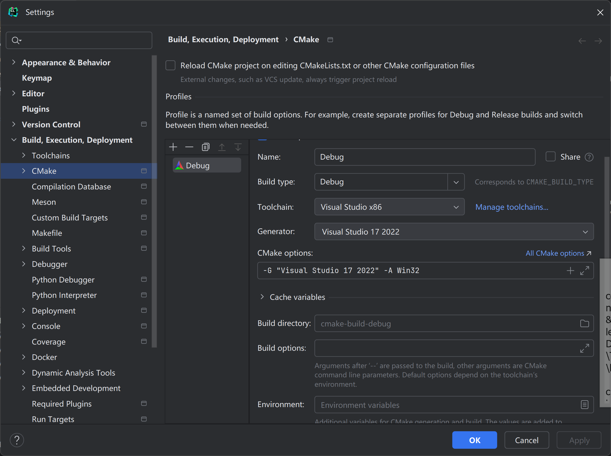
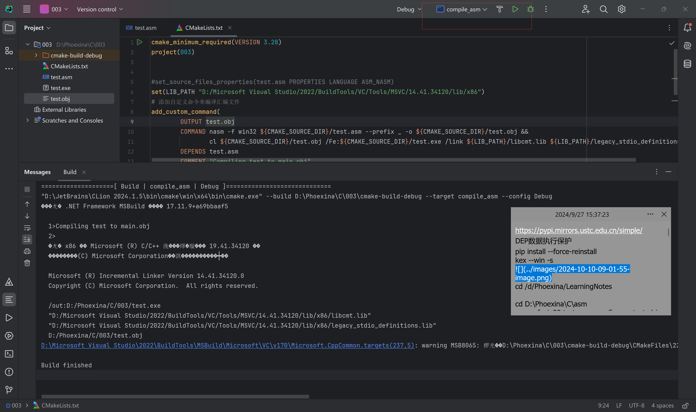
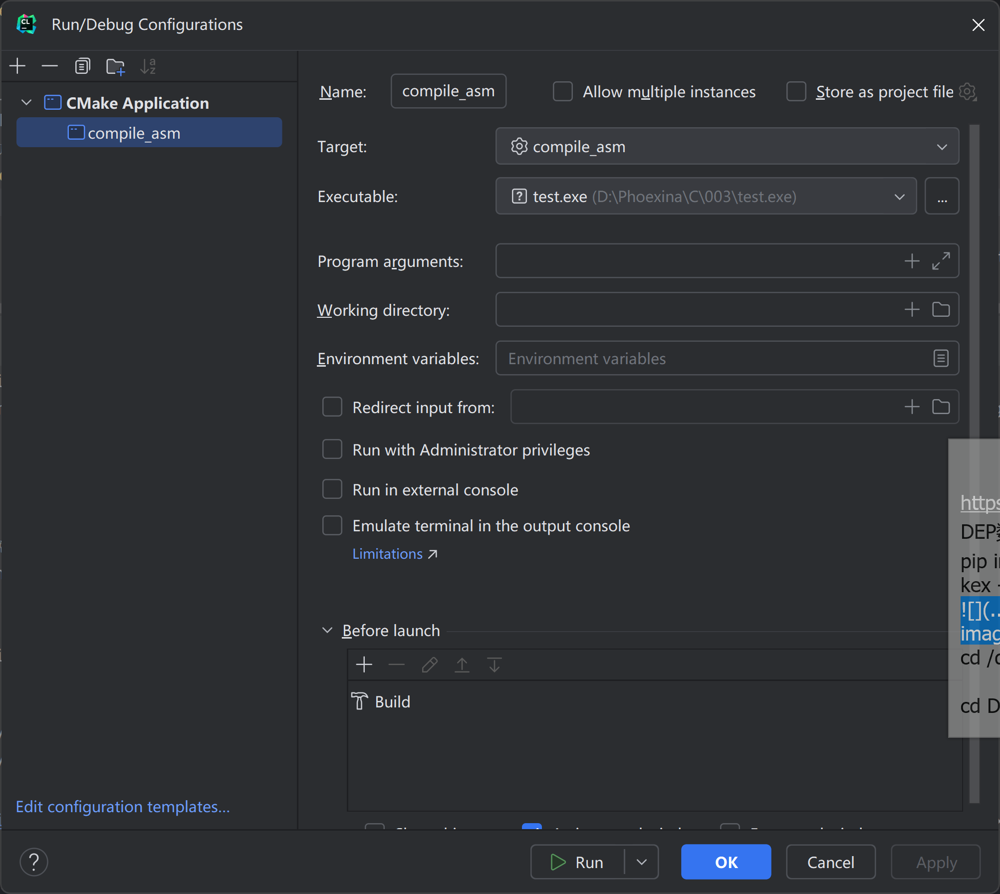

# ShellCode：汇编开发练习

---

## 1 shellcode编写环境

> nasm-2.16.03
> 
> VS2022 BuildTool
> 
> CLion / 010Editor写 + x32dbg调
> 
> [Clion中控制台中文出现乱码怎么解决？_clion中文乱码-CSDN博客](https://blog.csdn.net/qq_41854911/article/details/121895433)

### 1.1 命令行编译asm环境

首先编写一个简单的输出，最开始写的就是上一篇调用MessageBox的汇编，但是发现运行会卡住，应该需要手动导入dll才行。于是换成printf。

```nasm
extern printf
section .data  
    fmt db '%s', 0

section .text  
global main  

main:  
    XOR EBX, EBX
    PUSH EBX
    PUSH 0x54534554
    PUSH 0x44434241
    MOV EAX, ESP
    push eax
    push fmt
    call printf
    PUSH EBX
    MOV EAX, 0x7679D1D0
    CALL EAX
    ret
```

**使用nasm编译成obj**

需要--prefix 把所有函数名前加上下划线，这是window的要求。

相当于main->_main 和 printf->_printf

```shell
nasm -f win32 test.asm --prefix _ -o test.obj
```

**使用cl链接成可执行的exe**

libcmt.lib是必写的，没有这个会LINK : fatal error LNK1561: 必须定义入口点

legacy_stdio_definitions.lib是给_printf用的，没有会报error LNK2001: 无法解析的外部符号 _printf

```shell
cl test.obj /Fe:test.exe /link libcmt.lib legacy_stdio_definitions.lib
```

### 1.2 验证shellcode环境

mingw不能编译vs支持的`__asm`，而我实在是不想下vs的编译器。

之前编译汇编时用了asm文件，但是验证用clion还是没法关闭`DEP数据执行保护`。

结果发现Clion也可以直接用VS2022的BuildTool

（噫！那岂不是可以直接在clion里写汇编！不需要写asm文件再用nasm编译了）

配置如下：





> 一些执行shellcode的参考
> 
> [C语言执行shellcode的五种方法_c语言调用shellcode-CSDN博客](https://blog.csdn.net/liujiayu2/article/details/78294752)

main.c文件：

```c
#include <stdio.h>
//这个是上面那个连接给的shellcode拿来测试一下环境
unsigned char shellcode2[] =
        "\xd9\xeb\x9b\xd9\x74\x24\xf4\x31\xd2\xb2\x77\x31\xc9\x64\x8b"
        "\x71\x30\x8b\x76\x0c\x8b\x76\x1c\x8b\x46\x08\x8b\x7e\x20\x8b"
        "\x36\x38\x4f\x18\x75\xf3\x59\x01\xd1\xff\xe1\x60\x8b\x6c\x24"
        "\x24\x8b\x45\x3c\x8b\x54\x28\x78\x01\xea\x8b\x4a\x18\x8b\x5a"
        "\x20\x01\xeb\xe3\x34\x49\x8b\x34\x8b\x01\xee\x31\xff\x31\xc0"
        "\xfc\xac\x84\xc0\x74\x07\xc1\xcf\x0d\x01\xc7\xeb\xf4\x3b\x7c"
        "\x24\x28\x75\xe1\x8b\x5a\x24\x01\xeb\x66\x8b\x0c\x4b\x8b\x5a"
        "\x1c\x01\xeb\x8b\x04\x8b\x01\xe8\x89\x44\x24\x1c\x61\xc3\xb2"
        "\x08\x29\xd4\x89\xe5\x89\xc2\x68\x8e\x4e\x0e\xec\x52\xe8\x9f"
        "\xff\xff\xff\x89\x45\x04\xbb\x7e\xd8\xe2\x73\x87\x1c\x24\x52"
        "\xe8\x8e\xff\xff\xff\x89\x45\x08\x68\x6c\x6c\x20\x41\x68\x33"
        "\x32\x2e\x64\x68\x75\x73\x65\x72\x88\x5c\x24\x0a\x89\xe6\x56"
        "\xff\x55\x04\x89\xc2\x50\xbb\xa8\xa2\x4d\xbc\x87\x1c\x24\x52"
        "\xe8\x61\xff\xff\xff\x68\x6f\x78\x58\x20\x68\x61\x67\x65\x42"
        "\x68\x4d\x65\x73\x73\x31\xdb\x88\x5c\x24\x0a\x89\xe3\x68\x58"
        "\x20\x20\x20\x68\x4d\x53\x46\x21\x68\x72\x6f\x6d\x20\x68\x6f"
        "\x2c\x20\x66\x68\x48\x65\x6c\x6c\x31\xc9\x88\x4c\x24\x10\x89"
        "\xe1\x31\xd2\x52\x53\x51\x52\xff\xd0\x31\xc0\x50\xff\x55\x08";


int main() {
    printf("测试111\n");
    __asm {
        lea eax, shellcode2
        push eax
        ret
    }
    return 0;
}
```

Cmakelist.txt文件：主要是增加一条关闭DEP的，必须用vs2022的编译才能配置这个！

```cmake
target_link_options(001 PRIVATE /NXCOMPAT:NO /DYNAMICBASE:NO)
```

### 1.3 Clion编译asm环境

鉴于1.2中可以在Clion直接使用vs2022编译，那么汇编是不是也可以在clion里写。

网上有一些Clion配置asm的环境，但是不知道为什么一直报错感觉不太对

> 网上参考链接：
> 
> [在CLion中汇编.asm文件时出现CMake问题-腾讯云开发者社区-腾讯云](https://cloud.tencent.com/developer/ask/sof/850133)

链接的核心写法也贴一下防止链接消失

```cmake
project(003)
enable_language(ASM_NASM)
set(CMAKE_ASM_NASM_OBJECT_FORMAT win32)
set(CMAKE_ASM_NASM_COMPILE_OBJECT "<CMAKE_ASM_NASM_COMPILER> <INCLUDES> \
    <FLAGS> -f ${CMAKE_ASM_NASM_OBJECT_FORMAT} --prefix _ -o <OBJECT> <SOURCE>")
#但是这个命令用起来和直接nasm还不太一样，反正我的结果一直报错最后放弃
```

最后改成

```cmake
cmake_minimum_required(VERSION 3.28)
project(003)
set(LIB_PATH "D:/Microsoft Visual Studio/2022/BuildTools/VC/Tools/MSVC/14.41.34120/lib/x86")
# 添加自定义命令来编译汇编文件
add_custom_command(
        OUTPUT test.exe
        COMMAND cd ${CMAKE_SOURCE_DIR} &&
        (nasm -f win32 test.asm --prefix _ -o test.obj && cl test.obj /Fe:test.exe /link libcmt.lib legacy_stdio_definitions.lib )
        > output.log 2>&1 && type output.log
        DEPENDS test.asm
        COMMENT "Compiling test to main.obj"
)
#添加目标后，编译选择里可以选compile_asm
add_custom_target(compile_asm ALL DEPENDS test.exe)
```

编译效果如下：



还可以在这里配置一个直接执行编译好的test.exe，有asm修改时会自动编译再执行：



## 2 汇编开发

### 2.1 总体理解

终于写完了这段asm，从头整理一下重要的几个部分

- push栈数据：3个函数hash，2个位置的“user32”

- push预留函数指针位置：3个函数指针，这里分配了0x400感觉没必要

- 获取kernelbase基址：fs=TEB->PEB->LDR->dllList存储位置->dllList首地址->dllList[2]=kernel32.dll

- 大循环3次遍历函数hash：用小循环（匹配函数hash）找到字符串表的位次，在序号表中找到相应的序号，再用序号表找到地址表地址。其中[3]=MessageBox时，先调用找到的Load获取user32.dll的基址，放在原本放kernelbase基址的地方

- 小循环匹配函数hash：遍历字符串表的每一个字符串，在小小循环hash_loop遍历每个byte，通过al==ah判断是否为00，来判断字符串的结束，进入hash比较

- 普普通通的调用：调用之前保存地址的位置，函数没错就没啥问题。可能需要注意MessageBox调用完后eax和ecx会更改，重复使用参数时不要放在这里

### 2.2 详细注释的asm代码

直接放代码吧~~改变了书上的顺序，有点不理解书上的写法。还改了一下导出表的各个表地址的获取，感觉原来的代码写的很不可读（

注释里面写了进入大循环前的栈的状态

```nasm
extern printf
section .data  
    fmt db '%s', 0

section .text  
global main  

main: 
;抬高栈顶，将edi指向的更上层纳入栈顶下面
lea edi, [esp-0x0c] ;edi指向esp更顶的位置
xor ebx, ebx
mov bh, 0x04        ;bh是bx的高8位，相当于ebx=0x0400
sub esp, ebx        ;esp=esp-ebx

;写入user32
push 0x00003233
push 0x72657375
;写入hash，相当于一个数组{0x1e380a6a, 0xd3e32874, 0x0c917432}
push 0x1e380a6a    ;MessageBoxA
push 0xd3e32874    ;exit
push 0x0c917432    ;LoadLibraryA
mov esi, esp       ;加载数组尾地址


;ebp赋值为kernel32.dll基址
mov ecx, fs:[0x30]  ;x86中PEB指针位于fs=TEB结构体偏移0x30, x64中偏移为0x60
mov ecx, [ecx+0x0c] ;PEB结构体偏移0x0c到LDR
mov ecx, [ecx+0x1C] ;LDR偏移0x1c是dllList
mov ecx, [ecx]      ;ecx读取dllList首地址
mov ebp, [ecx+0x08] ;ebp读取dllList[2]=kernelbase.dll

;此时栈的状态
;低esp+04 08 0c 10 14 18 1c
; |0x0c917432| +00
; |0xd3e32874| +04
; |0x1e380a6a| +08
; |0x72657375| +0c
; |0x00003233| +10
;0x400{
;......
; |<-edi
; |
; |
;}
;高ebp-

;**************************************************大循环
find_lib_functions:
lodsd               ;eax=0x0c917432, esi指向数组下一位->[0xd3e32874]
cmp eax, 0x1e380a6a
jne find_functions
push esi
call [edi-0x08]
xchg eax, ebp    ;ebp=返回的user32.dll基址

;ebx保存导出名称表(字符串)地址, eax保存导出地址表(RVA)地址, ecx保存导出序号表
find_functions:
mov ebx, [ebp+0x3c]     ;dll基址偏移0x3c是PE头(相对基址的地址)
mov ecx, [ebp+ebx+0x78] ;PE头偏移0x78是导出表(相对基址的地址)
mov ebx, ecx            ;ebx=ecx=导出表

mov ebx, [ebp+ebx+0x20] ;导出表偏移0x20是导出名表(相对基址的地址)
add ebx, ebp            ;导出名称表相对地址+dll基址=实际地址

mov eax, [ebp+ecx+0x1c]
add eax, ebp            ;导出地址表(RVA)相对地址+dll基址=实际地址

mov ecx, [ebp+ecx+0x24]
add ecx, ebp            ;序号表相对地址+dll基址=实际地址


;----------------------------------------------小循环
push edi             ;没有pushad，全push了之后pop全覆盖了怎么存数据
push esi             ;总之这个地方懒得理解书上的写法
push eax
xor edi, edi
next_function_loop:
inc edi
mov esi, [ebx+edi*4] ;获取导出名称表中不同函数名字符串指针, edi为函数序号
add esi, ebp         ;字符串指针相对地址+dll基址=实际地址

cdq
hash_loop:
movsx eax, byte [esi]
cmp al, ah ;为什么不直接和0比较？应该只有al有值
je hash_compare
ror edx, 7
add edx, eax
inc esi
jmp hash_loop

hash_compare:
cmp edx, [esp+0x0c]     ;esp去掉保存的edi和esi后的栈顶，与hash比较
jne next_function_loop
mov edx, edi            ;edx接手edi,函数次序
pop eax
pop esi
pop edi
;---------------------------------------------小循环
;这里卡了很久！！！！
mov dx, [ecx+2*edx]   ;在序号表中找edx对应的序号读取，edx现在是序号了
mov eax, [eax+edx*4]  ;在地址表中偏移序号edx个指针
add eax, ebp          ;eax=函数地址
stosd                 ;将eax存入edi, edi指向下一个
pop eax               ;eax=栈顶，栈顶下降
cmp eax, 0x1e380a6a   ;不是最后一个就循环
jne find_lib_functions
;**************************************************大循环

fuction_call:
XOR EBX, EBX
PUSH EBX
PUSH 0x54534554
PUSH 0x44434241
mov esi, esp

;messagebox
push ebx
push esi
push esi
push ebx
call [edi-0x04]

;printf
push esi
push fmt
call printf

push ebx
call [edi-0x08]
ret
```

放一下第一次把MessageBox打出来的快乐截图


### 2.3 调试验证

#### 2.3.1 开发过程记录

已知需要拿到的指针，需要找到指向这个指针需要的地址。

一开始没理解字符串表位次和地址表偏移量关系的时候逆向的推了一下。大概场景如下：

`dll基址: 760b0000  字符串表首: 762d56cc  地址表首: 762d37a8 函数地址：761FDDD0`

761FDDD0-760b0000=14DDD0(相对dll地址)  ==转换为存储顺序==> D0DD1400

可以通过xdbg右键>搜索>所有系统模块>匹配特征打开，在十六进制里写D0DD1400，可以搜到数据为这个的地址！


可以看到一共就76118F2B和762D4808，还有在地址表首: 762d37a8后面，就是762D4808，就能算出需要的相对偏移量是762D4808 - 762d37a8 = 1060

不过还是要通过序号表查找才通用（不是通过公式算的

#### 2.3.2 验证

把编译好的二进制码拿到，用python脚本处理一下成为如下格式

主要我上面的汇编写了一个printf，输出用的“%s”和函数地址不是直接压入栈的，因此需要把这段删掉

```c
unsigned char shellcode[] =
        "\x8D\x7C\x24\xF4\x31\xDB\xB7\x04\x29\xDC\x68\x33\x32\x00\x00\x68\x75\x73\x65\x72"
        "\x68\x6A\x0A\x38\x1E\x68\x74\x28\xE3\xD3\x68\x32\x74\x91\x0C\x89\xE6\x64\x8B\x0D"
        "\x30\x00\x00\x00\x8B\x49\x0C\x8B\x49\x1C\x8B\x09\x8B\x69\x08\xAD\x3D\x6A\x0A\x38"
        "\x1E\x75\x05\x56\xFF\x57\xF8\x95\x8B\x5D\x3C\x8B\x4C\x1D\x78\x89\xCB\x8B\x5C\x1D"
        "\x20\x01\xEB\x8B\x44\x0D\x1C\x01\xE8\x8B\x4C\x0D\x24\x01\xE9\x57\x56\x50\x31\xFF"
        "\x47\x8B\x34\xBB\x01\xEE\x99\x0F\xBE\x06\x38\xE0\x74\x08\xC1\xCA\x07\x01\xC2\x46"
        "\xEB\xF1\x3B\x54\x24\x0C\x75\xE4\x89\xFA\x58\x5E\x5F\x66\x8B\x14\x51\x8B\x04\x90"
        "\x01\xE8\xAB\x58\x3D\x6A\x0A\x38\x1E\x75\xA0\x31\xDB\x53\x68\x54\x45\x53\x54\x68"
        "\x41\x42\x43\x44\x89\xE6\x53\x56\x56\x53\xFF\x57\xFC\x53\xFF\x57\xF8";
```

## 3 shellcode编码

### 3.1 编码解码

使用python来处理，输出为直接复制到c里使用的字符串格式

还包括使用key异或后的新字符串

```python
'''
input格式：
8B 04 90
01 E8
AB
58
3D 6A 0A 38 1E
75 A0
31 DB
'''


def convert_hex_to_byte_string(file_path):
    result = []

    with open(file_path, 'r') as file:
        for line in file:
            # 去除行尾换行符，并将空格去掉
            hex_values = line.strip().split()
            # 转换成相应的字节字符串格式
            byte_string = ''.join(f'\\x{value}' for value in hex_values)
            result.append(byte_string)

    # 将所有行合并为一行
    combined_string = ''.join(result)
    return combined_string

def print_combined_string(combined_string):
    # 每行最多 10 个 \xXX
    output_lines = []
    for i in range(0, len(combined_string), 80):  # 每行 20 个字符（10 个 \xXX）
        output_lines.append(f'"{combined_string[i:i + 80]}"')  # 用双引号包围

    formatted_output = '\n'.join(output_lines)
    print(formatted_output)


def hex_to_char_and_xor(hex_string, key):
    # 去除引号并处理字符串
    hex_string = hex_string.replace('"', '').replace('\\x', '')

    # 将十六进制字符串转换为字节
    byte_array = bytes.fromhex(hex_string)

    # 创建一个输出字符串列表以收集字节的十六进制表示
    xor_results = []

    # 遍历字节数组，进行异或操作并转换为字符
    for byte in byte_array:
        # 将字节与 key_byte 进行异或操作
        xor_byte = byte ^ key
        # 将异或结果转换为十六进制字符串并添加到结果列表中
        xor_results.append(f'\\x{xor_byte:02X}')  # 格式化为两位十六进制

    # 将结果列表的元素合并为字符串
    return ''.join(xor_results)


# 使用示例
if __name__ == "__main__":
    file_path = 'file/input.txt'  # 替换为你的文件路径
    combined_string = convert_hex_to_byte_string(file_path)
    print_combined_string(combined_string)
    print(len(combined_string)/4)
    print("--------------------------------------------------------------")
    key = 0x44
    print("key = ", key)
    print("--------------------------------------------------------------")
    res = hex_to_char_and_xor(combined_string, key)
    print_combined_string(res)
```

按书上写的加密后发现，我的汇编里存在0x90，导致解密程序读到那里提前结束了

只好换一下解码的结束条件，用两个nop来判断

```nasm
add eax, 0x1B
xor ecx, ecx
decode_loop:
mov bl, [eax+ecx]
xor bl, 0x44
mov [eax+ecx], bl
mov bx, [eax+ecx-1] ;新增获取转换好的前两个字符
inc ecx
cmp bx, 0x9090 ;新校验
jne decode_loop
```

key还是使用书上的0x44，0x90异或后是0xD4，在shellcode后面添加两个0xD4作为结束

新shellcode如下：

```c
unsigned char shellcode2[] =
        "\x83\xC0\x1B\x31\xC9\x8A\x1C\x08\x80\xF3\x44\x88\x1C\x08\x66\x8B\x5C\x08\xFF\x41"
        "\x66\x81\xFB\x90\x90\x75\xEA"
        "\xC9\x38\x60\xB0\x75\x9F\xF3\x40\x6D\x98\x2C\x77\x76\x44\x44\x2C\x31\x37\x21\x36"
        "\x2C\x2E\x4E\x7C\x5A\x2C\x30\x6C\xA7\x97\x2C\x76\x30\xD5\x48\xCD\xA2\x20\xCF\x49"
        "\x74\x44\x44\x44\xCF\x0D\x48\xCF\x0D\x58\xCF\x4D\xCF\x2D\x4C\xE9\x79\x2E\x4E\x7C"
        "\x5A\x31\x41\x12\xBB\x13\xBC\xD1\xCF\x19\x78\xCF\x08\x59\x3C\xCD\x8F\xCF\x18\x59"
        "\x64\x45\xAF\xCF\x00\x49\x58\x45\xAC\xCF\x08\x49\x60\x45\xAD\x13\x12\x14\x75\xBB"
        "\x03\xCF\x70\xFF\x45\xAA\xDD\x4B\xFA\x42\x7C\xA4\x30\x4C\x85\x8E\x43\x45\x86\x02"
        "\xAF\xB5\x7F\x10\x60\x48\x31\xA0\xCD\xBE\x1C\x1A\x1B\x22\xCF\x50\x15\xCF\x40\xD4"
        "\x45\xAC\xEF\x1C\x79\x2E\x4E\x7C\x5A\x31\xE4\x75\x9F\x17\x2C\x10\x01\x17\x10\x2C"
        "\x05\x06\x07\x00\xCD\xA2\x17\x12\x12\x17\xBB\x13\xB8\x17\xBB\x13\xBC\xD4\xD4";
```
