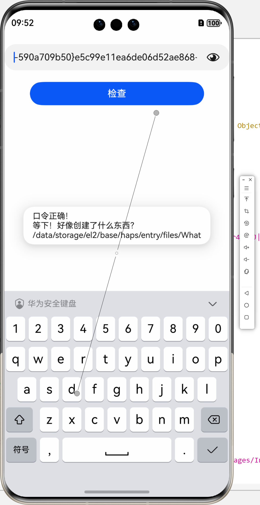

# 1 基本信息

> [!info] 
> 整理
> https://github.com/ohos-decompiler/Awesome-HarmonyOS-Reverse-Engineering
> 
> 模拟器root
> https://wuxianlin.com/2024/10/27/root-harmonyos-next-emultor/ 

## 1.1 lite与abc

用于watch的lite架构，hap直接解压缩后里面是bin文件，里面本质是个文件系统
格式都是length-file结构，可以解出目录结构，直接就是js文件


```python
import struct  
import os  
  
def export_one_file(bundle_name, file_name, file_path, file_content):  
    p = bundle_name + '/' + file_path.lstrip('/')  
    if not os.path.isdir(p):  
        os.makedirs(p)  
    with open(os.path.join(p, file_name), 'wb') as f:  
        f.write(file_content)  
  
  
  
def read_lv(f):  
    length_bytes = f.read(4)  
    if len(length_bytes) < 4:  
        return b'\0'  
    length = struct.unpack('>I', length_bytes)[0]  
    if length == 0:  
        return b''  
    data = f.read(length)  
    if len(data) < length:  
        print('文件可能损坏或不完整')  
        return b''  
    return data  
  
def split_bin_file(input_file):  
    with open(input_file, 'rb') as f:  
        f.read(1)  
        bundle_name = read_lv(f)  
        print(bundle_name)  
        while True:  
            file_name = read_lv(f)  
            file_path = read_lv(f)  
            nothing = read_lv(f)  
            file_content = read_lv(f)  
            if file_name == b'\0':  
                break  
            print(bundle_name, file_path, file_name, nothing, len(file_content))  
            export_one_file(bundle_name.decode(), file_name.decode(), file_path.decode(), file_content)  
  
  
input_filepath = 'file/entry-default-unsigned.bin'  
split_bin_file(input_filepath)

```


手机平板的普通hap，则是目录架构，里面是abc文件，需要反编译
devwco模拟器拖拽进去就可以安装了


.abcD
https://bbs.kanxue.com/thread-286792.htm
https://abcd.darknavy.org

内源的Z

基于java的
https://github.com/ohos-decompiler/abc-decompiler


明明是js为什么java也可以反编译？字节码？

## 1.2 模拟器

https://juejin.cn/post/7327538517528494090

x86 5.1.0(18)
https://update.dbankcdn.com/download/data/pub_13/HWHOTA_hota_900_9/3d/v3/GbjAZCwcRyyi8T89HM6D2A/system-image-phone_all-x86.zip

arm64 5.1.1(19)
https://update.dbankcdn.com/download/data/pub_13/HWHOTA_hota_900_9/c0/v3/NhGZ8iwqSmmi0araa2YwNQ/system-image-phone_all-arm64.zip

网上：
> [!info] 
> Phone-api9:
> https://update.dbankcdn.com/download/data/pub_13/HWHOTA_hota_900_9/9b/v3/XYQH_LUPQaa1XLkAibxMnQ/system-image-phone-x86-3.1.0.306.zip
> Phone-api6:
> https://update.dbankcdn.com/download/data/pub_13/HWHOTA_hota_900_9/b5/v3/wAbamXByQvWoWu2lOWp8lQ/system-image-phone-2.0.0.211.zip
> TV-api6:
> https://update.dbankcdn.com/download/data/pub_13/HWHOTA_hota_900_9/b5/v3/wAbamXByQvWoWu2lOWp8lQ/system-image-tv-2.0.0.577.zip
> Wearable-api6:
> https://update.dbankcdn.com/download/data/pub_13/HWHOTA_hota_900_9/b5/v3/wAbamXByQvWoWu2lOWp8lQ/system-image-wearable-2.0.0.902.zip 


通过命令行启动

```
"D:\Huawei\DevEco Studio\tools\emulator\Emulator" -path D:\Phoexina\Harmony\HarmonyOS_Next_Emulator\Emulator\test_phone -imageRoot D:\Phoexina\Harmony\HarmonyOS_Next_Emulator\sdk\

D:\Phoexina\Harmony\HarmonyOS_Next_Emulator>tools\emulator5.1\Emulator -path D:\Phoexina\Harmony\HarmonyOS_Next_Emulator\Emulator\test_phone -imageRoot D:\Phoexina\Harmony\HarmonyOS_Next_Emulator\sdk\

```


这个人似乎做了patch模拟器校验的东西

但找不到什么信息
https://github.com/RomashkaTea


试图在qemu里启动arm
https://github.com/ryzenstechdev/LibHMOS-NEXT/blob/main/arm64.md
https://hu60.cn/q.php/bbs.topic.106781.html


模拟器patch，跳过system-image校验
`75 63                          jnz     short loc_1405C5269`
改成jmp，跳过错误分支


## 1.3 元服务
https://uniapp.dcloud.net.cn/tutorial/mp-harmony/intro.html#failed-to-install-the-hap-or-hsp

# 2 CTF
## 2.1 Android？Harmony！

> [!info] 
> 题目来自
> https://www.52pojie.cn//thread-1973595-1-1.html
> 但是题目给的有问题 
> 


## 2.1 解密码

明明是从网上题解下载的文件，但是密钥却不一样


正向公式是 `(114514 * (x - 32) + 1919810) mod 95 + 32 = y` 


总感觉这个公式可以推导，搜了gpt


很好很好，死去信息安全数学基础开始攻击我
Gpt给的思路没问题，但是他常数计算mod算错了
大致列一下计算过程吧

```
(114514 * (x - 32) + 1919810) mod 95 + 32 = y
(114514 * (x - 32) + 1919810) mod 95 = y - 32
> k = y - 32
114514 * (x - 32) + 1919810 ≡ k mod 95
> 114514 % 95 = 39 | 1919810 % 95 = 50
39 * (x - 32) + 50 ≡ k mod 95
39 * (x - 32)  ≡ y - 32 - 50 mod 95
39 * (x - 32)  ≡ y - 82 mod 95
> 39 * 39 ≡ 1 mod 95
x - 32 ≡ 39 * (y - 82)  mod 95
x  ≡ 39 * (y - 82) + 32  mod 95
x = (39 * (y - 82) + 32) % 95
```

由于此时x也是可以%95的状态，所以x还需要根据有效值大小，判断是否需要+-95
代码如下：

```python
def hap_re_encode(a3):  
    v0 = ""  
    for i in range(0, len(a3)):  
        v4 = a3[i]  
        v6 = (39 * (ord(v4) - 82) + 32) % 95  
        if v6 < 33:  
            v6 += 95  
        elif v6 > 126:  
            v6 -= 95  
        v0 += chr(v6)  
    return v0

```




看起来创建的并不输出的这个目录？


看到了一个这样的文件


## 2.2 走迷宫

首先这道题有问题
这里的What文件应该是被密钥替换过的
题解中还需要自己将flag的字符放入，实际上并不需要


而在我们的题目中，起点在一个边边上，怎么看都不合理哇！根本没路


如果是正确的题目，应该直接从起点找到终点，拿到所有字符就是flag了
只能做到这里了zzz

其实到这里也和鸿蒙没有什么关系了，就是普通逆向题（？）
如果没有What文件的话，这个函数确实有点难懂


