# REVERSE题解

---

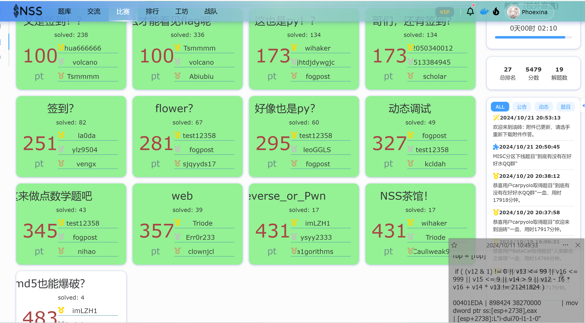

## 0 被气晕的题！！！有16个解

### 0.0 好像也是py？

补充：与出题人沟通了（但是好像没有什么公告？

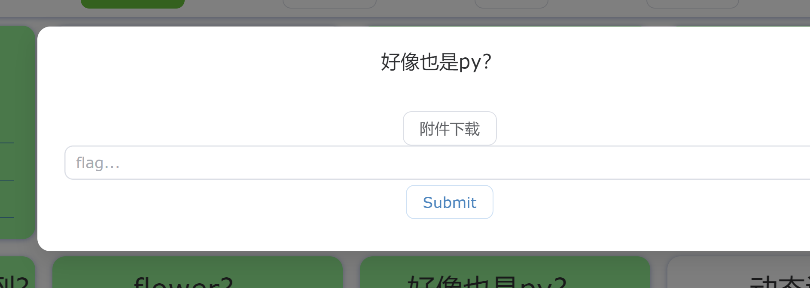

！！！！！就是这道题！！！！！

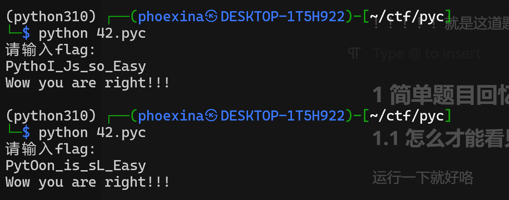

两个都是ok的！但是只有上面那个能用

简单说一下步骤

> [[原创]逆向Pyinstaller打包的程序源码及保护-软件逆向-看雪-安全社区|安全招聘|kanxue.com](https://bbs.kanxue.com/thread-277811.htm)
> [在线Python pyc文件编译与反编译](https://www.lddgo.net/string/pyc-compile-decompile)
> 
> 如果 pyc 文件版本 > Python 3.8 ，则只能选择 pycdc 反编译引擎。
> 
> 如果 pyc 文件版本 <= Python 3.8 ，推荐使用 uncompyle6 反编译引擎。

使用`struct.pyc`的文件头魔术字修复`4.pyc`的文件头，然后这个版本是3.10所以只能用pycdc解码。

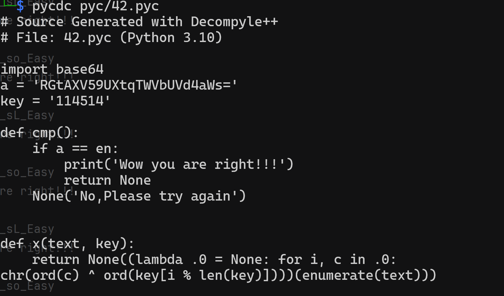

简单截个图，源码有了根据源码逆向就可以了

加密逻辑大概可以简化为

```python
def x(text, key):
    return ''.join(chr(ord(c) ^ ord(key[i % len(key)])) for i, c in enumerate(text))

def simple_add_sub(text, shift=3):
    return ''.join(chr(ord(c) + shift) if c.isalpha() else c for c in text)

def encrypt(text, key):
    xo = x(text, key)
    sp = xo.swapcase()
    ass = simple_add_sub(sp)
    encode = ass.encode()
    final_text = base64.b64encode(encode).decode()
    if a == final_text:
        print('Wow you are right!!!\n')
    else:
        print('No,Please try again\n')
    return final_text
```

其中x就是异或，逆向时直接调就好了，base64是反过来，网站上也能跑

重点是这个simple_add_sub！就是它导致了这么多个解！

其实自己逆向应该只会出两个结果

```python
def simple_add_sub_re(text):
    result = []  # 初始化结果列表

    for c in text:  # 遍历输入字符串中的每个字符
        new_char = chr(ord(c) - 3)
        if new_char.isalpha():  # 检查字符是否为字母
            result.append(new_char)  # 添加新字符到结果列表
        else:
            result.append(c)  # 直接添加非字母字符

    final_result = ''.join(result)  # 合并结果列表为字符串
    return final_result  # 返回最终结果


def decrypt():
    assre = base64.b64decode(a).decode()
    spre = simple_add_sub(assre, shift=-3) #正确的flag
    print(spre)
    xore = spre.swapcase()
    print(xore)
    print(x(xore, key))
    spre = simple_add_sub_re(assre) #不是flag但也可以运行成功
    xore = spre.swapcase()
    print(xore)
    textre = x(xore, key)
    print(textre)
```

在正向加密中，如果是字母则向后偏移3位，如果不是字母就不变。

这就出现了问题，可能是x,y,z向后偏移出的非字母，也可能一开始就不是字母

想要获得指定base64只能使用`Dk@]^}Q{jMe[QWxik`

如果认为所有偏移后不是字母的都本来也不是字母，则spre是`Ah@]^}N{gJb[NTufh`，用原函数-3即可，它会检验现在是字母的-3（其实这个逻辑也不太对，只是刚好没有abc罢了

而这个是flag的解法

如果认为所有偏移前可以是字母的都是字母，则spre是`Ah@Z^zNxgJbXNTufh`，需要写新函数，即校验-3后是不是字母，如果不是字母就不动

这两个都是可以写代码算出来的能运行的

但我们知道了原理，相当于每个单独的xyz都可以单独选择是否+3，这就是一个排列组合了

用python算一下排列组合，我是拼接的xore的步骤，在上面说的字符串还进行了一次大小写互换

```python
from itertools import product

def generate_combinations(replacements):
    # 使用 itertools.product 生成所有组合
    return list(product(*replacements))

# 生成替换字符
replacements = [['z', ']'], ['Z', '}'], ['X', '{'], ['x', '[']]
print(replacements)
# 生成所有组合
result = generate_combinations(replacements)
print(f"Total combinations: {len(result)}")
for combo in result:
    xoremay = 'aH@'+combo[0]+'^'+combo[1]+'n'+combo[2]+'GjB'+combo[3]+'ntUFH'
    input = x(xoremay, key)
    print(input)
    encrypt(input, key)
```

最后的结果都贴出来好了，抄歪了，最后一个应该是第一个（

| 所有                             | 成功的               | 结果                  |                   |
| ------------------------------ | ----------------- | ------------------- | ----------------- |
| PytOon_is_so_Easy              | PytOon_Js_sL_Easy | PytOon_Js_so_Easy   | PytOoI_is_sL_Easy |
| PytOoI_is_so_Easy              | PytOoI_Js_sL_Easy | PytOoI_Js_so_Easy   | Python_is_sL_Easy |
| <mark>Python_is_so_Easy</mark> | Python_Js_sL_Easy | Python_Js_so_Easy   | PythoI_is_sL_Easy |
| PythoI_is_so_Easy              | PythoI_Js_sL_Easy | `PythoI_Js_so_Easy` | PytOon_is_sL_Easy |

出题人看一看，凭什么`PythoI_Js_so_Easy`才是flag，凭什么标黄的那个不是flag！

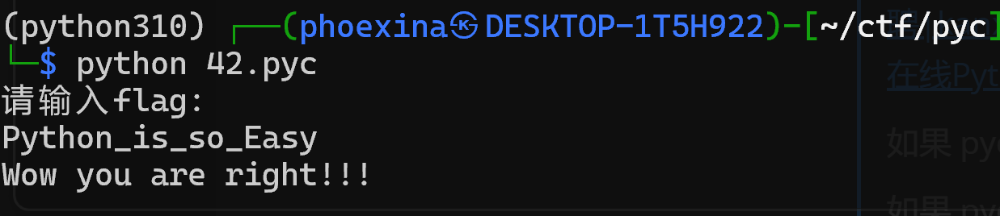

！！！！！！！！卡了我一下午！！！！！！！！

## 1 简单题目回忆录

### 1.1 怎么才能看见flag呢

运行一下就好咯

### 1.2 又是签到！？

> 很好的参考
> 
> [JadxGUI逆向分析工具下载与安装_jadx下载-CSDN博客](https://blog.csdn.net/loveliqi/article/details/133879252)

安卓的apk，我莫得环境（

之后再说

直接用jadx-gui反汇编看源码

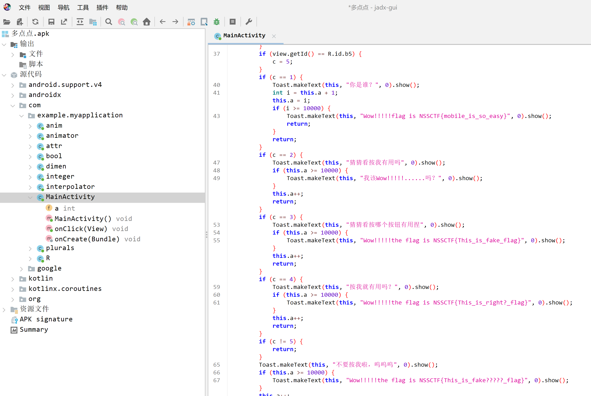

### 1.3 这也是py！？

这个文件是python编译出的exe反汇编成的字节码文件

我大致搜了一下，没有把字节码变成源码的工具，这合理吗？

虽然把整个字节码文件发给gpt它会傻掉，但是逐句发还是很稳的

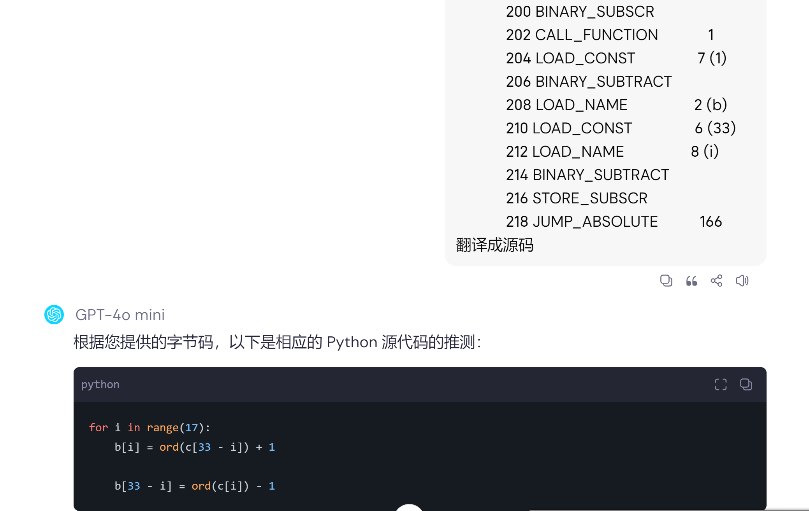

放一下我的python文件，引号里的是字节码翻译过来的源码

下面是对照源码写的逆向求flag

```python
'''
a = '~hojutfsfuoJ`pt`th^dcnbdsxAzESBRRM'
b = [0] * 59
print(len(a))

print('PLZ input your flag: ')
c = input()

for i in range(17):
    b[i] = ord(c[33 - i]) + 1
    b[33 - i] = ord(c[i]) - 1
    print(i,b[i],b[33 - i],ord(a[i]))

for i in range(34):
    if b[i] != ord(a[i]):
        print('Wrong')
        break

print('Great!!!')
'''

a = '~hojutfsfuoJ`pt`th^dcnbdsxAzESBRRM'
b = [ord(char) for char in a]
print(b)
c = [0] * 34

for i in range(17):
    print(b[i], b[33-i])
    c[33 - i] = b[i] - 1
    c[i] = b[33 - i] + 1

result_string = ''.join(chr(num) for num in c)
print(result_string)
```

### 1.4 web

太简单了，pwn最后一题做了一天，这个居然只要10分钟

我愿称为这是gpt在做题而不是我（

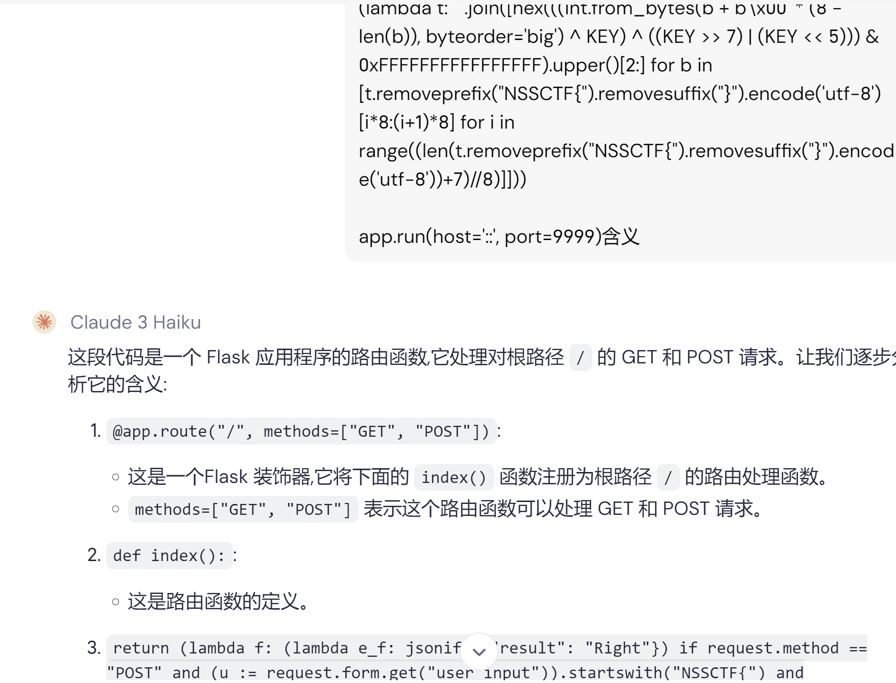

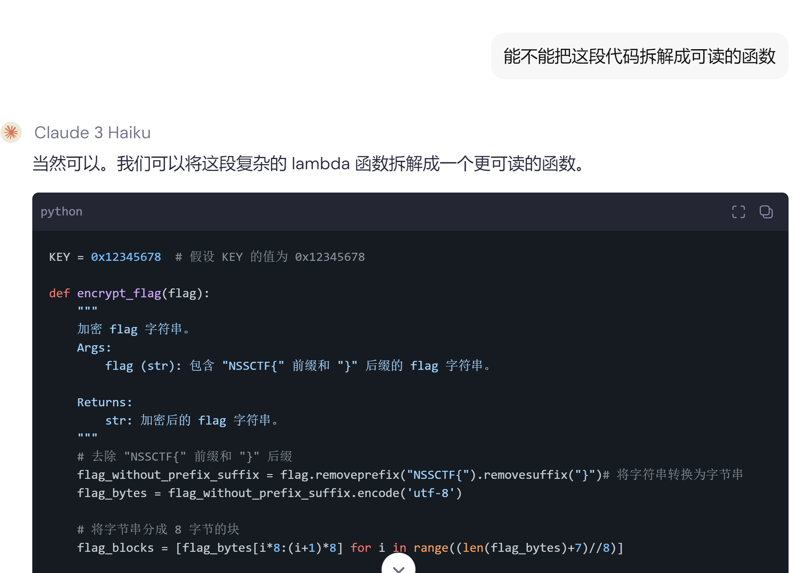

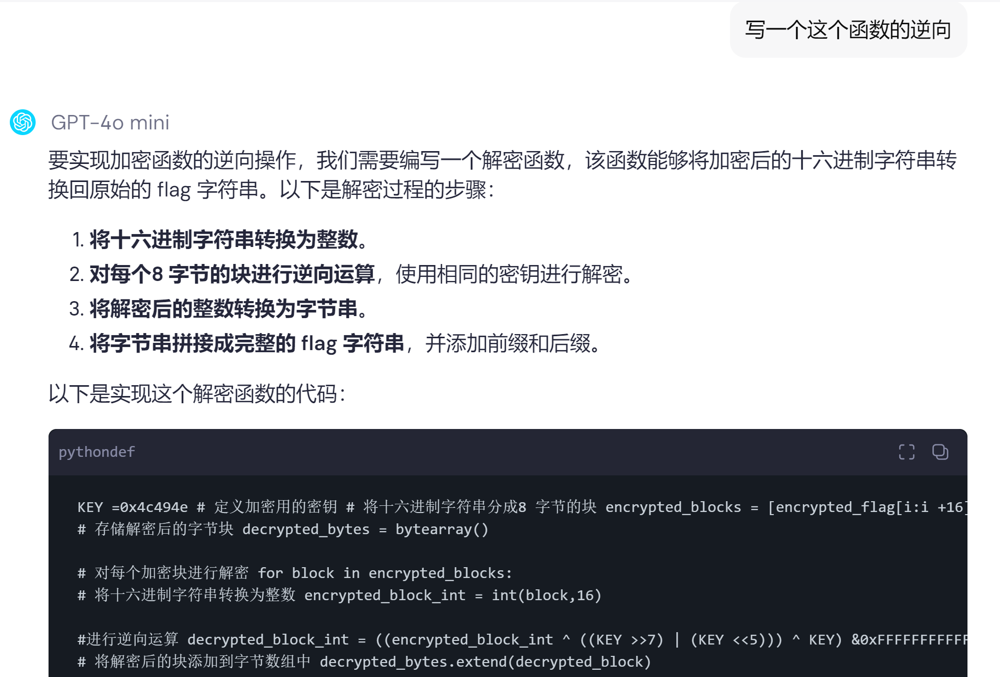

甚至没有任何改动就结束了（

放个代码

```python
    KEY = 0x4c494e  # 假设 KEY 的值为 0x12345678
    flag = 'NSSCTF{abcdefg_hijklmn}'
    flag_without_prefix_suffix = flag.removeprefix("NSSCTF{").removesuffix("}")    # 将字符串转换为字节串
    flag_bytes = flag_without_prefix_suffix.encode('utf-8')

    # 将字节串分成 8 字节的块
    flag_blocks = [flag_bytes[i * 8:(i + 1) * 8] for i in range((len(flag_bytes) + 7) // 8)]

    # 对每个块进行加密
    encrypted_blocks = []
    for block in flag_blocks:
        print(block)
        # 将块转换为大端序整数
        block_int = int.from_bytes(block + b'\x00' * (8 - len(block)), byteorder='big')  # 进行加密运算
        encrypted_block_int = ((block_int ^ KEY) ^ ((KEY >> 7) | (KEY << 5))) & 0xFFFFFFFFFFFFFFFF
        # 将加密后的整数转换为十六进制字符串
        encrypted_block_hex = hex(encrypted_block_int).upper()[2:]
        print(encrypted_block_hex)
        encrypted_blocks.append(encrypted_block_hex)  # 将加密后的块拼接成一个字符串
    encrypted_flag = "".join(encrypted_blocks)
    #383964303BF292AF2D39653368E8C4FE36302D386DF691B1343066396CA195A96435316509C5F09C
    print(encrypted_flag)

    encrypted_flag = '383964303BF292AF2D39653368E8C4FE36302D386DF691B1343066396CA195A96435316509C5F09C'
    KEY = 0x4c494e
    encrypted_blocks = [encrypted_flag[i:i +16] for i in range(0, len(encrypted_flag),16)]
    decrypted_bytes = bytearray()

    for block in encrypted_blocks:
        encrypted_block_int = int(block,16)
        decrypted_block_int = ((encrypted_block_int ^ ((KEY >>7) | (KEY <<5))) ^ KEY) &0xFFFFFFFFFFFFFFFF
        decrypted_block = decrypted_block_int.to_bytes(8, byteorder='big')  # 将解密后的整数转换为字节串
        decrypted_bytes.extend(decrypted_block)
        decrypted_bytes = decrypted_bytes.rstrip(b'\x00')

    decrypted_flag_without_prefix_suffix = decrypted_bytes.decode('utf-8')
    decrypted_flag = f"NSSCTF{{{decrypted_flag_without_prefix_suffix}}}"  ## 添加前缀和后缀
    print(decrypted_flag)
```

## 2 IDA (+xdbg?)

### 2.1 签到？

一个普通的exe文件，linux上也可以运行（当然肯定用xdbg调试

不知道为什么开始没跑起来（结果卡了半天

对我来说不是签到了，还是研究了好一会的：(

总之首先看IDA

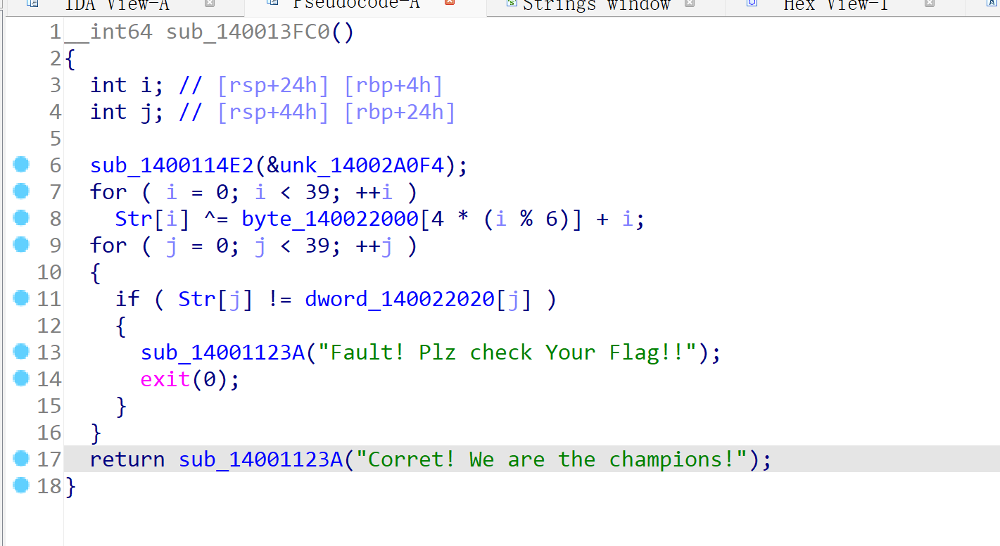

看起来似乎已经给了算法，但是这个算法有问题！

再看看数据

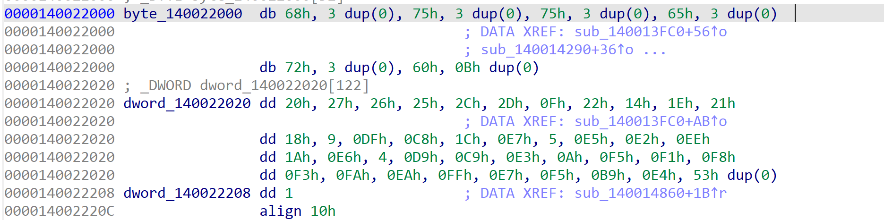

从结果来看这里写的其实直接就可以得到了，但是第一次看的时候还不理解0的干什么的

数据应该是这样的 b==>byte_用于计算，data==>dword_用于比较结果

```python
b = [0x6E, 0x73, 0x73, 0x63, 0x74, 0x66]
data = [
0x20, 0x27, 0x26, 0x25, 0x2C, 0x2D, 0x0F, 0x22, 0x14, 0x1E, 0x21,
0x18, 0x09, 0xDF, 0xC8, 0x1C, 0xE7, 0x05, 0xE5, 0xE2, 0xEE,
0x1A, 0xE6, 0x04, 0xD9, 0xC9, 0xE3, 0x0A, 0xF5, 0xF1, 0xF8,
0xF3, 0xFA, 0xEA, 0xFF, 0xE7, 0xF5, 0xB9, 0xE4]
```

其实就是把那些0去掉就可以了，他们在内存的格式是：

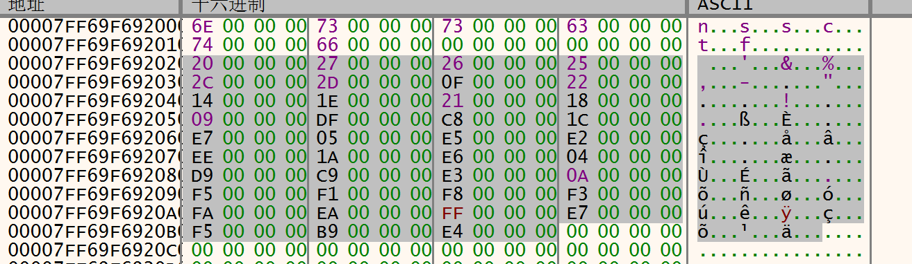

IDA里的4*是错误的！这个4是为了偏移这些0

总之最后还是自己单步分析了一下汇编

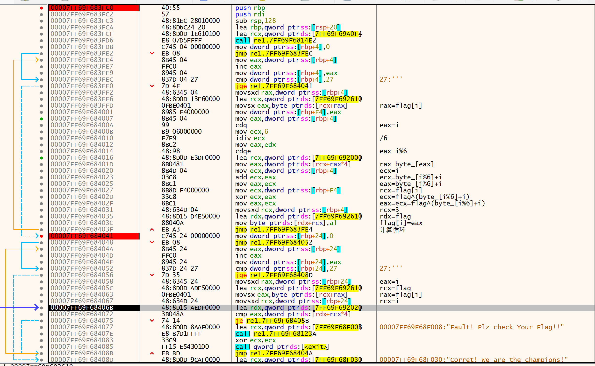

也就是原来的逻辑如下，test2是我的测试输入

```python
for i in range(39):
    testres[i] = test2[i] ^ (b[i%6] + i)
```

逆向过来的解法就是

```python
for i in range(39):
    flag[i] = data[i] ^ (b[i%6] + i)
    print(i, chr(flag[i]),flag[i], hex(data[i]))
```

感谢gpt的直接转格式，虽然整体很准确，但是这里有两位转错了！害的我卡了一会（

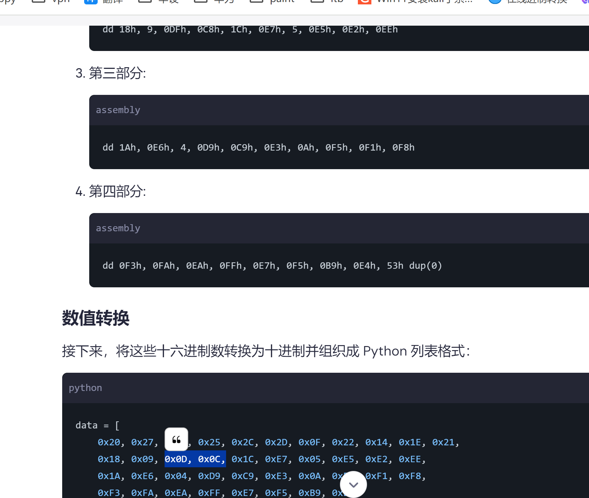

### 2.2 不是，哥们，还有签到？

这个没有用xdbg了

看一下IDA就能看到原逻辑是

```python
    input = [0]*31
    a1 = [
        0x63, 0x5E, 0x4C, 0x5A, 0x52, 0x15, 0x4A, 0x5A, 0x0D, 0x16, 0x15,
        0x12, 0x76, 0x7F, 0x01, 0x33, 0x2D, 0x35, 0x17, 0x7F, 0x61, 0x0F,
        0x21, 0x64, 0x3C, 0x31, 0x01, 0x40, 0x20, 0x5C, 0x59, 0x45
    ]
    print(len(a1))
    '''
    #原逻辑
    for i in range(31):
        a1[i] = (rand() % 100 + i) ^ input[i]
    '''
```

也就是说我们需要知道rand()，一开始还想爆破一下后来发现这个实在太大了

于是就想到了rand()是不是不是随机的

随后发现了代码里的`srand(0x1BF52u)`，去搜了一下发现种子相同随机数序列是一致的

于是用C输出了一下随机数

```c
int main() {
    // 设置随机数种子
    srand(0x1BF52u);
    for (int i = 0; i < 32; i++) {
        int random_number = rand();
        printf("%d, ", random_number%100);
    }
    return 0;
}
```

最后拿这个随机数计算输出！

```python
    random.seed(0x1BF52)
    r = [45, 12, 29, 22, 2, 78, 43, 1, 96, 64, 82, 86, 29, 32, 86, 67, 49, 72, 92, 13, 33, 75, 56, 36, 87, 63, 82, 21, 48, 28, 6, 22]
    for i in range(31):
        input[i] = (r[i] + i) ^ a1[i]
    print_array_to_str(input)
```

### 2.3 flower？

> 可能有用的讲解
> 
> [CTF逆向Reverse 花指令介绍 and NSSCTF靶场入门题目复现_ctf逆向工程基础题-CSDN博客](https://blog.csdn.net/Sciurdae/article/details/133750478)

首先，这个文件跑起来输入后会报错，放进IDA无法F5反汇编

根据标题，搜索了一下花指令，大概这就是不可执行的

试图配置了ida的python环境，但是把指令nop后，后面的并没有自动变成新汇编

> 补充：IDA可以Edit>Patch Program>change byte来替换
> 
> 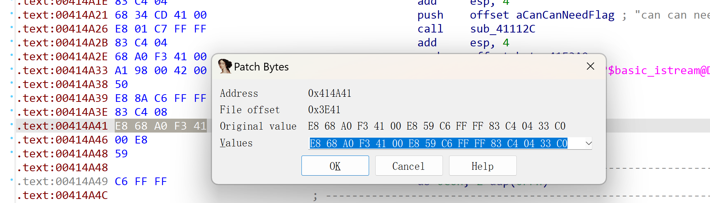
> 
> 替换后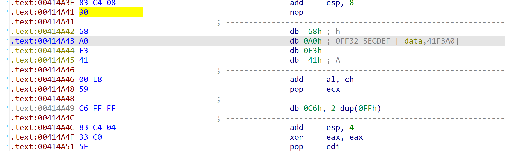
> 
> 在68代码位置按c
> 
> 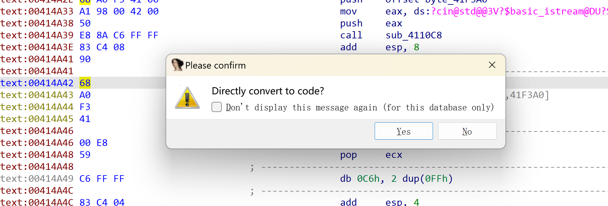
> 
> 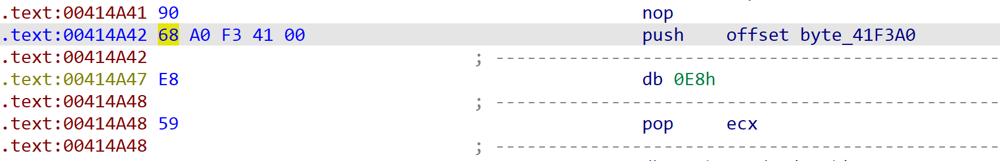
> 
> 这行就重新变成code了
> 
> 在下一行再按一次c，就修复了
> 
> 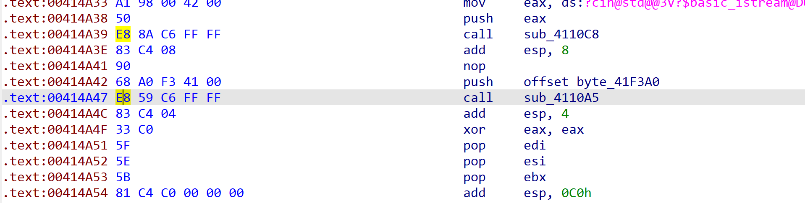

改用xdbg

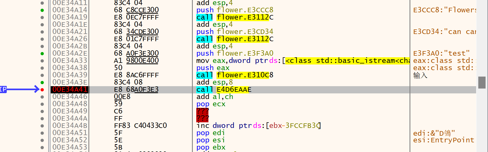

就是这行进去就会报错了，看起来本来应该是去校验了

总之把这行机器码搞下来试试，在win上用不了这个disasm不知道为什么，只好在我的wsl kali上跑了（

```python
from pwn import *
line = b'\xE8\x68\xA0\xF3\x41\x00\xE8\x59\xC6\xFF\xFF'
context(log_level = 'debug', arch = 'i386', os = 'windows')
print(line[1:])
print(disasm(line[1:]))
```

可以截断组合一下看看结果，显然招新赛没有搞搜到的那么复杂的东西，第一个字节去掉就可以用了

直接在xdbg上修改汇编

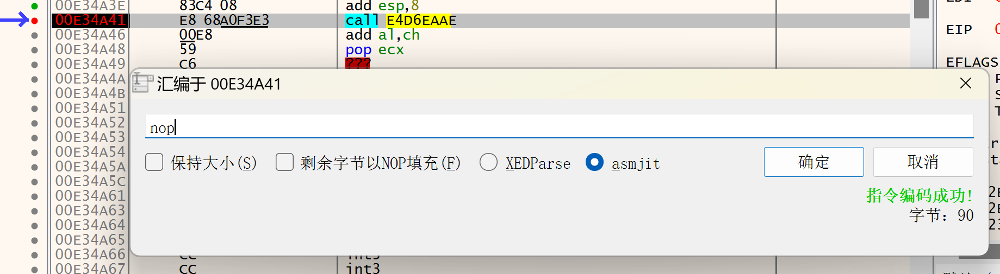

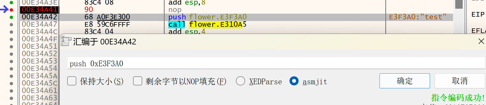

好哦，改好后运行下去，发现后面就没有报错了

导出新的exe，文件>补丁>修补文件，运行一下发现可以正常结束了

再次放入IDA反汇编

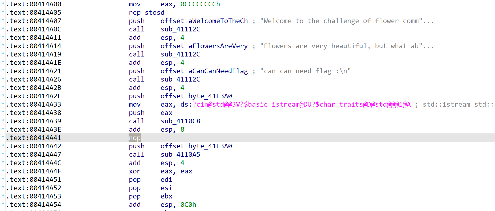

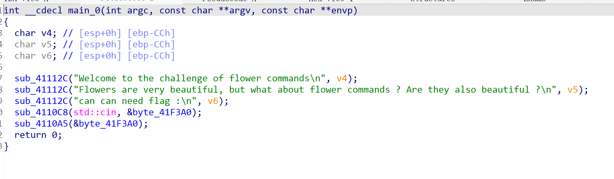

点进函数里后面都是这种比较

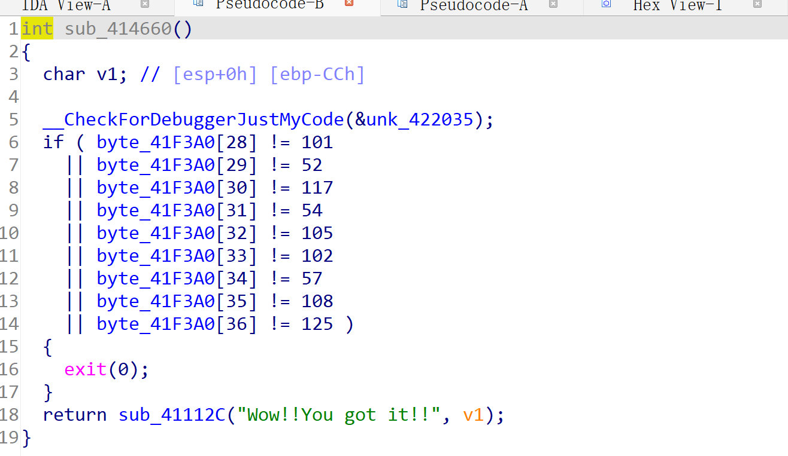

直接组合一下就可以输出了！

```python
a1 = [78, 83, 83, 67, 84, 70, 123,
          84, 57, 105, 115, 95, 70, 49,
          111, 119, 53, 114, 95, 105, 115,
          95, 86, 101, 114, 121, 95, 66,
          101, 52, 117, 54, 105, 102, 57, 108, 125]
print(a1[7], a1[13])
print(a1[14], a1[20])
print_array_to_str(a1)
```

再次感谢gpt的转换，不加不要废话的话，它会解析一大堆（

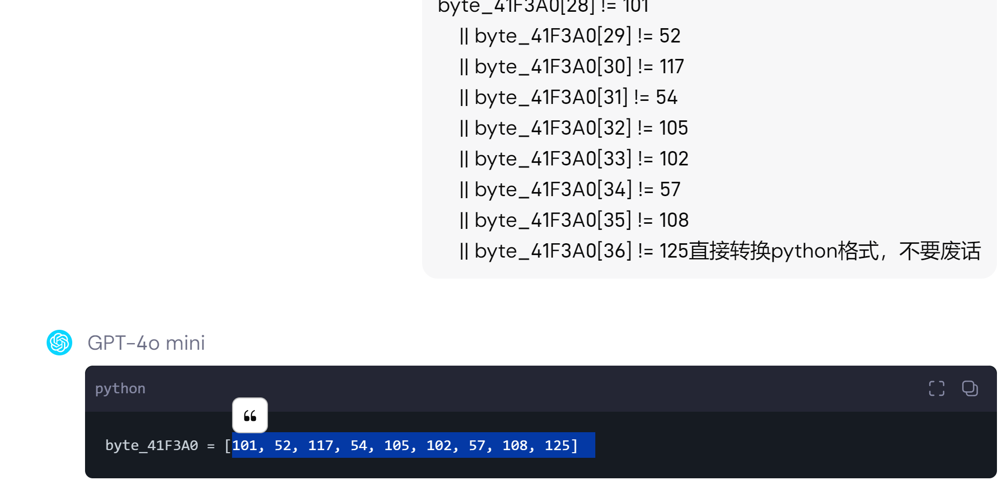

### 2.4 动态调试

但是好像不需要动态调试（微妙

放入IDA反汇编就能看到大概的逻辑是先rc4_init再rc4_crypt

点进函数里面也都是清晰的代码，只要还原出来就可以得到（可以整理一下参数

为什么不用python了呢，因为IDA的反汇编能直接用，太方便了！

已知用来校验结果的数组大小为44，输入的数组也应该大小是44，就省略了计算长度的部分

```cpp
char key[] = "ysyy_114514";
unsigned int keylen = strlen(key);
const unsigned int res[256] = {
        0xCF, 0xA0, 0xC7, 0x24, 0x93, 0xEC, 0x51, 0xFB,
        0x5E, 0xA5, 0xEE, 0xC5, 0xE7, 0xEA, 0xBB, 0x4A,
        0xE0, 0x6E, 0x16, 0x63, 0xF0, 0x1A, 0x91, 0x04,
        0xC1, 0x7E, 0x3F, 0x2B, 0x4F, 0x53, 0xB0, 0x62,
        0xA3, 0xA1, 0xCF, 0xC1, 0x73, 0x85, 0x5F, 0xEC,
        0x14, 0xD8, 0xD4, 0xE2, 0x00, 0x00, 0x00, 0x00
};

void rc4_init(unsigned int *s)
{
    char k[256]; // [rsp+0h] [rbp-80h] BYREF
    unsigned int tmp; // [rsp+107h] [rbp+87h]
    int j; // [rsp+108h] [rbp+88h]
    int i; // [rsp+10Ch] [rbp+8Ch]
    j = 0;
    memset(k, 0, sizeof(k));
    tmp = 0;
    for ( i = 0; i <= 255; ++i )
    {
        s[i] = i;
        k[i] = key[i % keylen];
    }
    for ( i = 0; i <= 255; ++i )
    {
        j = (k[i] + j + s[i]) % 256;
        tmp = s[i];
        s[i] = s[j];
        s[j] = tmp;
    }
}

void rc4_crypt(unsigned int *s, unsigned int *Data, unsigned int Len)
{
    unsigned int v3; // r12
    unsigned int v4; // di
    unsigned int tmp; // [rsp+2Fh] [rbp-11h]
    unsigned int k; // [rsp+34h] [rbp-Ch]
    int j; // [rsp+38h] [rbp-8h]
    int i; // [rsp+3Ch] [rbp-4h]

    i = 0;
    j = 0;
    for ( k = 0; k < Len; ++k )
    {
        i = (i + 1) % 256;
        j = (j + s[i]) % 256;
        tmp = s[i];
        s[i] = s[j];
        s[j] = tmp;
        v3 = Data[k];
        v4 = s[(s[i] + s[j] + 1) % 256];
        Data[k] = v3 ^ (v4 + key[k % keylen]);
    }
    //rc4_init(s);
}
```

加密的主逻辑其实就是，要求data的结果与res一致，data就是输入字符串转出来的int数组

```python
unsigned int data[256] = {0};
unsigned int s[256] = {0};
rc4_init(s);
rc4_crypt(s, data, 44);
print_int_array(data);
print_int_array(res);
```

保险起见可以在这里，用动态调试校验一下加密算法的准确性

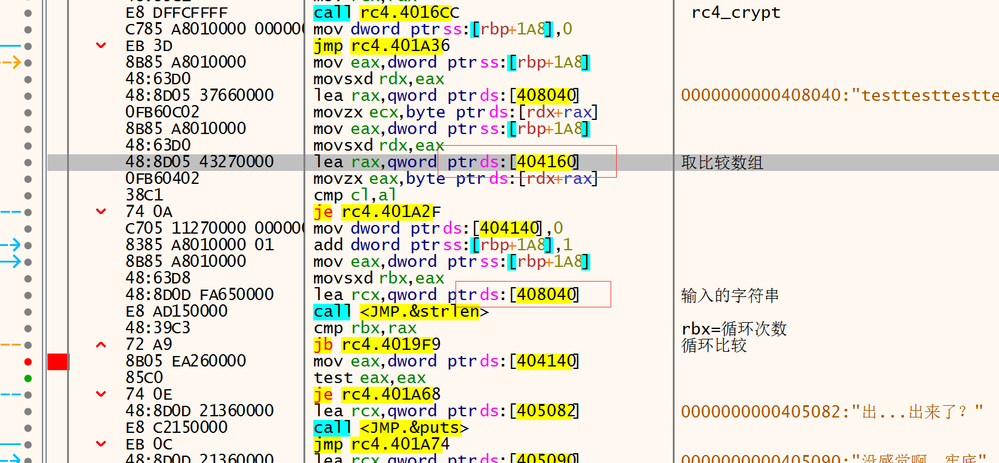

在408040这个地址看到加密过的输入，与自己的算法跑出来的对比一下

确定加密算法没问题后

仔细看看代码，rc4_init其实是固定用来初始化s[256]的，是不变的

需要逆向的只有rc4_crypt，但是这个看看，就这句`Data[k] = v3 ^ (v4 + key[k % keylen])`是会改变的，其他都是固定的。异或只需要再跑一遍就是解密

代码如下：

```cpp
rc4_init(s);
for ( i = 0; i <= 44; ++i )
    data[i] = res[i];
rc4_crypt(s, data,44);
print_int_array(data);

std::string flag = "";
for ( i = 0; i < 45; ++i ) {
    flag += data[i];
}
std::cout << flag << std::endl;

rc4_init(s);
rc4_crypt(s, data, 44);
print_int_array(data);
print_int_array(res);
```

结果如下：

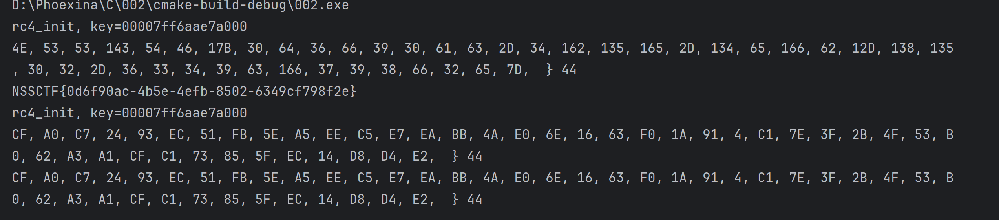

### 2.5 这来做点数学题吧

IDA的逻辑很简单，就是输入数组，然后直接等式判断

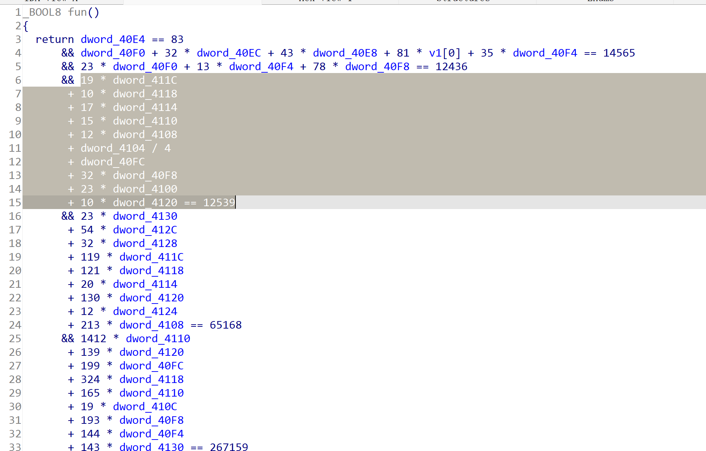

可以让gpt转成

```python
expression = '''
    (v1[1] == 83) &&  
    (v1[4] + 32 * v1[3] + 43 * v1[2] + 81 * v1[0] + 35 * v1[5] == 14565) &&  
    (23 * v1[4] + 13 * v1[5] + 78 * v1[6] == 12436) &&  
    (19 * v1[15] + 10 * v1[14] + 17 * v1[13] + 15 * v1[12] + 12 * v1[10] + v1[9] / 4 + v1[7] + 32 * v1[6] + 23 * v1[8] + 10 * v1[16] == 12539) && 
    (23 * v1[20] + 54 * v1[19] + 32 * v1[18] + 119 * v1[15] + 121 * v1[14] + 20 * v1[13] + 130 * v1[16] + 12 * v1[17] + 213 * v1[10] == 65168) &&  
    (1412 * v1[12] + 139 * v1[16] + 199 * v1[7] + 324 * v1[14] + 165 * v1[12] + 19 * v1[11] + 193 * v1[6] + 144 * v1[5] + 143 * v1[20] == 267159) &&  
    (867 * v1[13] + 654 * v1[11] + 678 * v1[9] + 175 * v1[7] + 45 * v1[5] + 21 * v1[1] + 13 * v1[3] + 100 * v1[15] +  24 * v1[17] == 244923) &&  
    (54 * v1[12] + 55 * v1[20] + 119 * v1[17] + 121 * v1[16] + 20 * v1[3] + 130 * v1[18] + 12 * v1[19] + 213 * v1[12] == 69874) &&  
    (v1[7] == 90) && (v1[20] == 125) &&  
    (233 * v1[10] + 134 * v1[2] + 378 * v1[4] + 133 * v1[9] + 178 * v1[6] + 443 * v1[5] + 11 * v1[1] + 543 * v1[11] == 188780) &&  
    (194 * v1[16] + 643 * v1[15] + 131 * v1[14] + 131 * v1[12] + 21 * v1[13] + 204 * v1[17] + 24 * v1[18] + 214 * v1[19] == 151642) &&  
    (123 * v1[18] + 25 * v1[16] + 124 * v1[13] + 37 * v1[14] + 7457 * v1[15] + 129 * v1[17] + 164 * v1[19] + 10 * v1[20] == 772291) &&  
    (132 * v1[16] + 807 * v1[15] + 756 * v1[14] + 163 * v1[13] + 633 * v1[12] + 423 * v1[11] + 42 * v1[10] + 534 * v1[17] == 346862) &&  
    (867 * v1[18] + 5956 * v1[13] + 204 * v1[12] + 374 * v1[10] + 47 * v1[9] + 485 * v1[15] + 37 * v1[16] + 375 * v1[20] == 740703) &&  
    (37 * v1[12] + 35 * v1[19] + 856 * v1[18] + 375 * v1[17] + 3578 * v1[16] + 567 * v1[3] + 55 * v1[20] + 21 * v1[4] == 436075) &&  
    (59 * v1[7] + 52 * v1[2] + 102 * v1[3] + 24 * v1[4] + 204 * v1[5] + 13 * v1[6] + 54 * v1[8] + 13 * v1[9] == 38344) &&  
    (98 * v1[7] + 85 * v1[6] + 13 * v1[4] + 19 * v1[3] + 12 * v1[1] + 166 * v1[2] + 25 * v1[5] + 23 * v1[8] == 39337) &&  
    (52 * v1[0] + 45 * v1[1] + 19 * v1[7] + 76 * v1[20] + 12 * v1[15] == 20141) &&  
    (56 * v1[1] + 34 * v1[0] + 75 * v1[7] + 80 * v1[20] + 16 * v1[15] + 19 * v1[12] == 27375) &&  
    (54 * v1[12] + 76 * v1[7] + 87 * v1[1] + 54 * v1[0] + 16 * v1[20] + 18 * v1[15] + 39 * v1[18] == 31598)
'''
```

最开始构造矩阵用np.linalg.solve，结果不太对（

想通过已知前缀限定一下，np也做不了，矩阵是固定的

后来得到大佬指点，了解的z3，用了一下

可能需要conda的虚拟环境

```python
from z3 import *

# 创建 Z3 变量
v1 = [Real(f'v[{i}]') for i in range(21)]

# 创建约束
s = Solver()
s.add(v1[0] == 78) #N
s.add(v1[1] == 83) #S
s.add(v1[2] == 83) #S
s.add(v1[3] == 67) #C
s.add(v1[4] == 84) #T
s.add(v1[5] == 70) #F
s.add(v1[6] == 123) #{
s.add(v1[4] + 32 * v1[3] + 43 * v1[2] + 81 * v1[0] + 35 * v1[5] == 14565)
s.add(23 * v1[4] + 13 * v1[5] + 78 * v1[6] == 12436)
#s.add(19 * v1[15] + 10 * v1[14] + 17 * v1[13] + 15 * v1[12] + 12 * v1[10] + v1[9] / 4 + v1[7] + 32 * v1[6] + 23 * v1[8] + 10 * v1[16] == 12539)
s.add(23 * v1[20] + 54 * v1[19] + 32 * v1[18] + 119 * v1[15] + 121 * v1[14] + 20 * v1[13] + 130 * v1[16] + 12 * v1[17] + 213 * v1[10] == 65168)
s.add(1412 * v1[12] + 139 * v1[16] + 199 * v1[7] + 324 * v1[14] + 165 * v1[12] + 19 * v1[11] + 193 * v1[6] + 144 * v1[5] + 143 * v1[20] == 267159)
s.add(867 * v1[13] + 654 * v1[11] + 678 * v1[9] + 175 * v1[7] + 45 * v1[5] + 21 * v1[1] + 13 * v1[3] + 100 * v1[15] + 24 * v1[17] == 244923)
s.add(54 * v1[12] + 55 * v1[20] + 119 * v1[17] + 121 * v1[16] + 20 * v1[3] + 130 * v1[18] + 12 * v1[19] + 213 * v1[12] == 69874)
s.add(v1[7] == 90)
s.add(v1[20] == 125)
s.add(233 * v1[10] + 134 * v1[2] + 378 * v1[4] + 133 * v1[9] + 178 * v1[6] + 443 * v1[5] + 11 * v1[1] + 543 * v1[11] == 188780)
s.add(194 * v1[16] + 643 * v1[15] + 131 * v1[14] + 131 * v1[12] + 21 * v1[13] + 204 * v1[17] + 24 * v1[18] + 214 * v1[19] == 151642)
s.add(123 * v1[18] + 25 * v1[16] + 124 * v1[13] + 37 * v1[14] + 7457 * v1[15] + 129 * v1[17] + 164 * v1[19] + 10 * v1[20] == 772291)
s.add(132 * v1[16] + 807 * v1[15] + 756 * v1[14] + 163 * v1[13] + 633 * v1[12] + 423 * v1[11] + 42 * v1[10] + 534 * v1[17] == 346862)
s.add(867 * v1[18] + 5956 * v1[13] + 204 * v1[12] + 374 * v1[10] + 47 * v1[9] + 485 * v1[15] + 37 * v1[16] + 375 * v1[20] == 740703)
s.add(37 * v1[12] + 35 * v1[19] + 856 * v1[18] + 375 * v1[17] + 3578 * v1[16] + 567 * v1[3] + 55 * v1[20] + 21 * v1[4] == 436075)
s.add(59 * v1[7] + 52 * v1[2] + 102 * v1[3] + 24 * v1[4] + 204 * v1[5] + 13 * v1[6] + 54 * v1[8] + 13 * v1[9] == 38344)
s.add(98 * v1[7] + 85 * v1[6] + 13 * v1[4] + 19 * v1[3] + 12 * v1[1] + 166 * v1[2] + 25 * v1[5] + 23 * v1[8] == 39337)
s.add(52 * v1[0] + 45 * v1[1] + 19 * v1[7] + 76 * v1[20] + 12 * v1[15] == 20141)
s.add(56 * v1[1] + 34 * v1[0] + 75 * v1[7] + 80 * v1[20] + 16 * v1[15] + 19 * v1[12] == 27375)
s.add(54 * v1[12] + 76 * v1[7] + 87 * v1[1] + 54 * v1[0] + 16 * v1[20] + 18 * v1[15] + 39 * v1[18] == 31598)

flag = ''
# 求解
if s.check() == sat:
    model = s.model()
    print("解为:")
    for i in range(len(v1)):
        num = model[v1[i]].as_decimal(10)  # 将 Z3 数值转换为十进制字符串
        num_value = float(num)  # 转换为浮点数
        print(f'v1[{i}] = {num_value}')  # 打印数值

        # 如果 num_value 是一个有效的 ASCII 值，则转换为字符
        if 0 <= num_value < 256:  # 确保在 ASCII 范围内
            ch = chr(int(num_value))
            flag += ch
            print(f'  ch = {ch}')
        else:
            print('  ch = 不在 ASCII 范围内')
else:
    print("没有找到可行解")

print(flag)
```

就出来了！当然一开始是增加了前缀，注释了几行，直接就出来了

后来反推发现现在注释的这行有点问题，IDA这行写了/4，估计是反编译有问题吧

不管了，z3确实so eay

### 2.6 NSS茶馆！

首先先跑一下看看是怎么运行的

一开始对着图片按1和2都莫得反应，后来看了下源码，用了kbhit()

这个函数通常用于实现基于控制台的交互式程序，于是跑去看控制台了

终于搞明白了用法。

按1会让你输入flag，按2会给一个假flag。也就是说1后面可能有flag校验

断点单步到1的流程里，会先构造一个输入框，然后就是下面的核心函数了

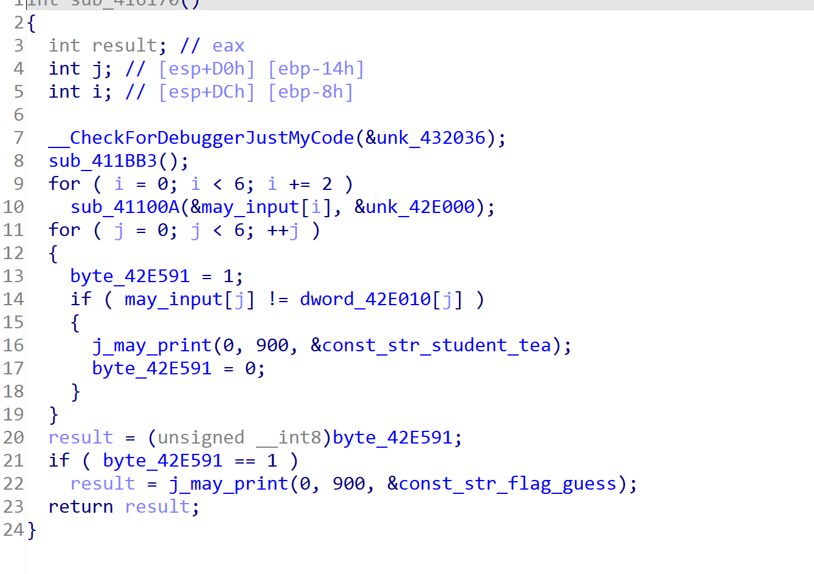

第一行的sub_411BB3会调到这里来

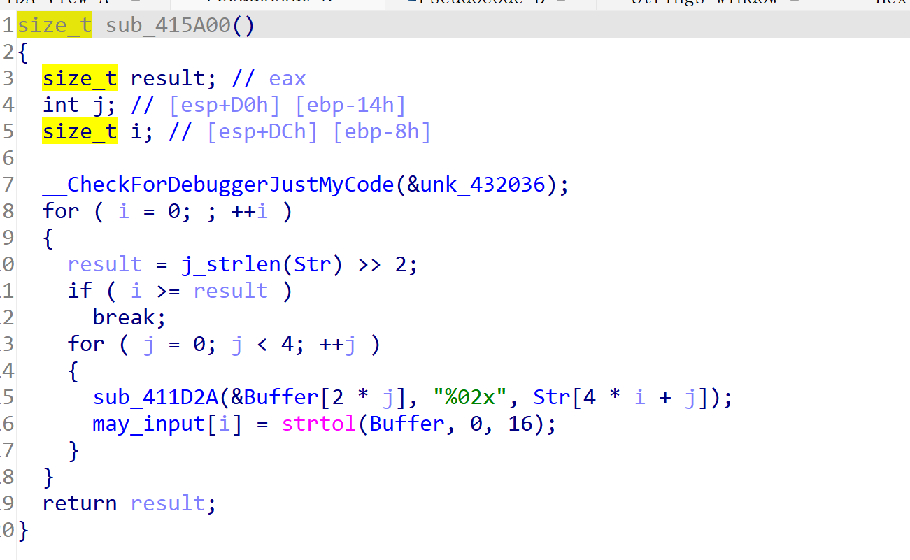

相当于把每个字符转换成十六进制，4个十六进制排成一个字符串，再一把转成数字

```cpp
void processString(const char* Str, unsigned int* may_input) {
    char Buffer[INPUT_LEN] = {0};
    for (int i = 0; i < strlen(Str) / 4; ++i) {
        for (int j = 0; j < 4; ++j) {
            sprintf(Buffer+2*j, "%02x", Str[4 * i + j]);
            may_input[i] = strtol(Buffer, nullptr, 16);
            printf("%d|%s=%c|%d ",i, Buffer, Str[4 * i + j], 4 * i + j);
        }
    }
    printf("\n");
}
```

顺便写一个逆向，这个时候还不知道input的长度，定义了一个宏，之后好改

```cpp
void processStringre(char* Str, size_t* input) {
    for (size_t i = 0; i < INPUT_LEN; i++) {
        for (int j = 0; j < 4; j++) {
            Str[i * 4 + 3 - j] = (char)((input[i] >> (j * 8)) & 0xFF);
        }
    }
}
```

自己创建数据校验了一下，没有问题就继续了

接下来的循环里的函数，循环是6，说明input大小是6。INPUT_LEN定义为7。

循环内接下来会调用：

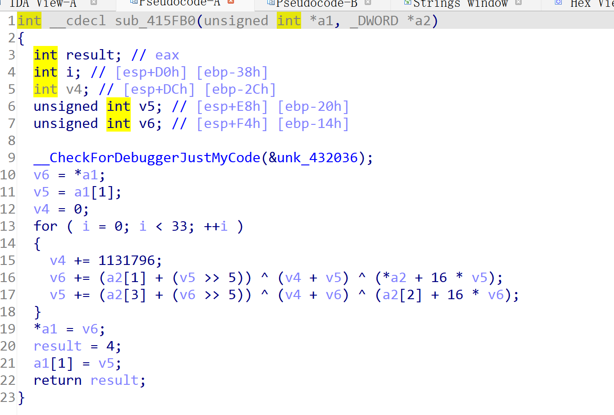

可以直接送去gpt转换一下，大概是通过a1=输入input指针一次性对连续的两个数做操作

a2是固定的，这个函数里的循环内的v4也是固定的，可以直接做成数组使用，方便逆向

直接放代码：

```cpp
int v4[34] = {1131796, 2263592, 3395388, 4527184, 5658980, 6790776, 7922572, 9054368, 10186164, 11317960, 12449756, 13581552, 14713348
        , 15845144, 16976940, 18108736, 19240532, 20372328, 21504124, 22635920, 23767716, 24899512, 26031308, 27163104, 28294900
        , 29426696, 30558492, 31690288, 32822084, 33953880, 35085676, 36217472, 37349268};

void may_encode(unsigned int *a1) {
    const unsigned int a2[] = {0x0B, 0x16, 0x21, 0x2C};
    unsigned int v6= a1[0];
    unsigned int v5 = a1[1];
    printf("[%p]: %x %x\n", a1, a1[0], a1[1]);

    for (int i = 0; i < 33; ++i) {
        //v4 += 1131796;
        v6 += (a2[1] + (v5 >> 5)) ^ (v4[i] + v5) ^ (a2[0] + 16 * v5);
        v5 += (a2[3] + (v6 >> 5)) ^ (v4[i] + v6) ^ (a2[2] + 16 * v6);
        //printf("%d, ", v4);
    }
    //printf("\n");
    a1[0] = v6;
    a1[1] = v5;
}
void may_decode(unsigned int *a1) {
    const unsigned int a2[] = {0x0B, 0x16, 0x21, 0x2C};
    unsigned int v6 = a1[0];
    unsigned int v5 = a1[1];

    for (int i = 32; i >= 0 ; i--) {
        //v4 += 1131796;
        v5 -= (a2[3] + (v6 >> 5)) ^ (v4[i] + v6) ^ (a2[2] + 16 * v6);
        v6 -= (a2[1] + (v5 >> 5)) ^ (v4[i] + v5) ^ (a2[0] + 16 * v5);
    }

    a1[0] = v6;
    a1[1] = v5;
}
```

最后就是校验了，dword_42E010是固定的但是格式不太对

IDA没有转换成4个十六进制一组的数字的排列，而是把每个十六进制单独放

还要自己转一下

不过最准确的是直接看动态调试的内存啦

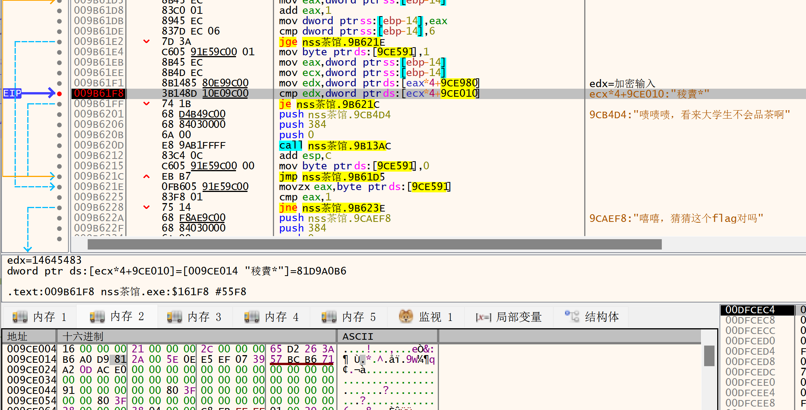

```cpp
//unsigned int check[] = {0x3A26D265, 0xB6A0D981, 0x2A005E0E, 0xE5EF0739, 0x57BCB671, 0xA20DACE0};
unsigned int check[] = {0x3A26D265, 0x81D9A0B6, 0x0E5E002A, 0X3907EFE5, 0x71B6BC57, 0xE0AC0DA2};
```

到这里就可以全部逆向了

```cpp
int main() {
    unsigned int input[INPUT_LEN] = {0};
    char flag[INPUT_LEN*4] = {};
    for (int i = 0; i < 6; i += 2 ) {
        may_decode(&check[i]);
    }
    for(int i = 0; i < INPUT_LEN; i++){
        printf("%x, ", check[i]);
    }
    printf("\n");
    processStringre(flag, check);
    std::cout<<flag<<std::endl;
    return 0;
}
```

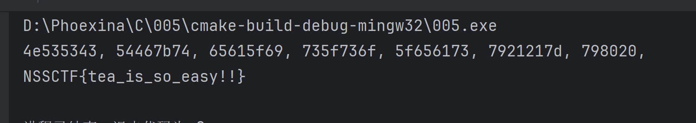

## 3 卡住&没做完

### 3.1 Reverse_or_Pwn

一道微妙的题，做到最后卡住了。去和前面那个微妙的py题出题人问了一下，还是他出的。就聊了一下，本质上还是多解的，但这个，我觉得可以理解吧

以后这种题还是要多想想（）

输入是一个字符串和一个数字

先看代码，一开始那个数字用z3没解出来，就先强制跳转了

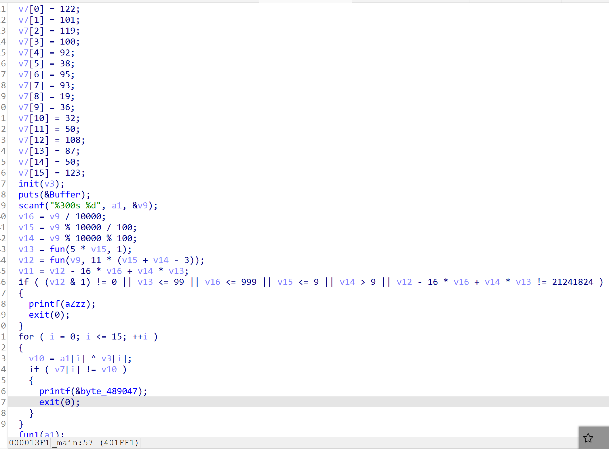

字符串好解，init()里面是一个固定种子的随机数，自己跑没跑出来，直接拿内存里的用了

v7 = 字符串a1 ^ v3，直接逆向就好了

代码如下：

```cpp
int v3[] = {0x2E, 0x0D, 0x1E, 0x17, 0x03, 0x4F, 0x2C, 0x02,
        0x61, 0x41, 0x53, 0x57, 0x1E, 0x21, 0x57, 0x44};
int v7[] = {122, 101, 119, 100, 92, 38, 95, 93, 19, 36, 32, 50, 108, 87, 50, 123};
char a1[17] = {0};
for (int  i = 0; i <= 15; ++i ) {
    //v7[i] = a1[i] ^ v3[i];
    a1[i] = v7[i] ^ v3[i];
    printf("[%d] %c = %d ^ %d\n", i, a1[i], v7[i], v3[i]);
}
```

代码调用到这里，又调一个下面的fun1就结束了。这时候不太理解func1是做什么的

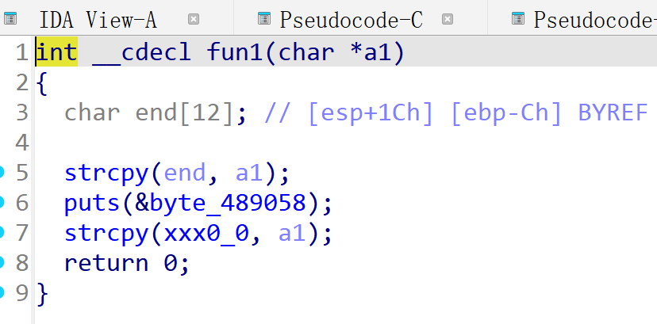

但是发现代码里有完全没被用到却存在的函数？看起来还很重要

是从字符串搜索定位过来的，因为这个aWoW字符串说了拿到flag了

在这个位置：

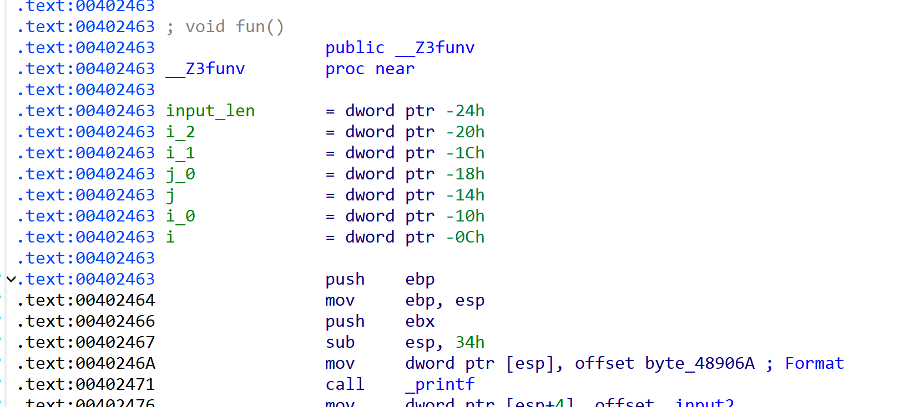

反编译一下

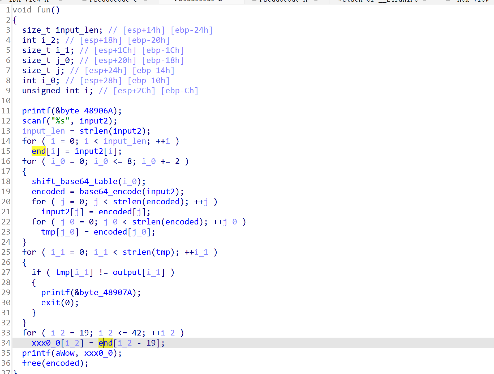

最开始直接改exe，直接跳转过来

大概就是输入一下字符串，通过下面的函数换表，然后base64

> 理解换表，里面第一题：
> 
> [[原创]MRCTF2021逆向题解-CTF对抗-看雪-安全社区|安全招聘|kanxue.com](https://bbs.kanxue.com/thread-267013-1.htm)

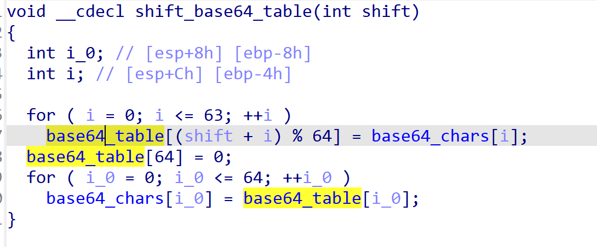

```cpp
void shift_base64_table(int shift)
{
    for (int i = 0; i <= 63; ++i )
        base64_table[(shift + i) % 64] = base64_chars[i];
    base64_table[64] = 0;
    for (int i = 0; i <= 64; ++i )
        base64_chars[i] = base64_table[i];
}

void funbase64(char *input2) {
    for (int i = 0; i <= 8; i += 2 ) {
        shift_base64_table(i);
        char *encoded = base64_encode(input2, base64_table);
        for (int j = 0; j < strlen(encoded); ++j ){
            input2[j] = encoded[j];
        }
    }
    //input2 = output
}
```

可以通过这个函数生成要换的所有表，存一下，然后写逆向

```cpp
char base64_tables[][65] = {"ABCDEFGHIJKLMNOPQRSTUVWXYZabcdefghijklmnopqrstuvwxyz0123456789+/",
                           "+/ABCDEFGHIJKLMNOPQRSTUVWXYZabcdefghijklmnopqrstuvwxyz0123456789",
                           "6789+/ABCDEFGHIJKLMNOPQRSTUVWXYZabcdefghijklmnopqrstuvwxyz012345",
                           "0123456789+/ABCDEFGHIJKLMNOPQRSTUVWXYZabcdefghijklmnopqrstuvwxyz",
                           "stuvwxyz0123456789+/ABCDEFGHIJKLMNOPQRSTUVWXYZabcdefghijklmnopqr"};
```

感觉base64的加密解密可能会经常用，存成文件了

```cpp
#include <cstdlib>
#include <cstring>
#include <iostream>
#include <cstdint>


char* base64_encode(const char* str, const char *base64_table) {
    int str_len = strlen(str);
    int len = (str_len % 3) ? 4 * (str_len / 3 + 1) : 4 * (str_len / 3);
    char* res = static_cast<char*>(malloc(len + 1));
    if (!res){
        std::cout<< "base64_encode Error!" <<std::endl;
        return nullptr;
    }


    int i = 0;
    for (int j = 0; j < str_len; j += 3) {
        res[i] = base64_table[static_cast<unsigned char>(str[j]) >> 2];
        res[i + 1] = base64_table[((static_cast<unsigned char>(str[j]) & 3) << 4) | (static_cast<unsigned char>(str[j + 1]) >> 4)];
        res[i + 2] = base64_table[((static_cast<unsigned char>(str[j + 1]) & 0xF) << 2) | (static_cast<unsigned char>(str[j + 2]) >> 6)];
        res[i + 3] = base64_table[static_cast<unsigned char>(str[j + 2]) & 0x3F];
        i += 4;
    }

    if (str_len % 3 == 1) {
        res[i - 2] = '=';
        res[i - 1] = '=';
    } else if (str_len % 3 == 2) {
        res[i - 1] = '=';
    }

    res[len] = '\0';
    return res;
}

char* base64_decode(const char* input, const char *base64_table) {
    int input_len = strlen(input);
    // 检查输入长度是否为4 的倍数
    //assert((input_len % 4) == 0);

    int output_len = (input_len * 3) / 4;
    char* output = static_cast<char*>(malloc(output_len + 1));
    if (!output)
        return nullptr;

    int j = 0;
    for (int i = 0; i < input_len; i += 4) {
        uint8_t quad[4];
        for (int k = 0; k < 4; k++) {
            // 查找 base64 表中每个字符的十进制值
            for (int m = 0; base64_table[m]; m++) {
                if (input[i + k] == base64_table[m]) {
                    quad[k] = static_cast<uint8_t>(m);
                    break;
                }
            }
        }

        // 检查第一个和第二个字符是否有效
        //assert(quad[0] < 64 && quad[1] < 64);

        // 解码第一个字节
        output[j++] = static_cast<char>((quad[0] << 2) | (quad[1] >> 4));

        // 如果第三个字符不是 '='，则解码第二个字节
        if (quad[2] < 64) {
            output[j++] = static_cast<char>((quad[1] << 4) | (quad[2] >> 2));

            // 如果第四个字符不是 '='，则解码第三个字节
            if (quad[3] < 64) {
                output[j++] = static_cast<char>((quad[2] << 6) | quad[3]);
            }
        }
    }

    output[output_len] = '\0';
    return output;
}
```

然后就可以写这个函数的逆向：

```cpp
void funbase64re(char *res) {
    for (int i = 8; i >= 0; i-=2) {
        char *decoded = base64_decode(res, base64_tables[i/2]);
        std::cout<< strlen(res) <<" "<< strlen(decoded) <<std::endl;
        for (int j = 0; j < strlen(decoded); ++j ){
            res[j] = decoded[j];
            res[j+1] = 0;
        }
    }
}
```

还需要拿一下output，我记得这个地方没什么坑

这里看IDA看到xxx0_0就是flag，但是这里只赋值了19~42，因此前面的信息估计就是放在flag前面的，可是这样还差了16，17，18？于是只好去解那个数字

```cpp
char xxx0_0[44] = {};
char output[] = "+/1k6wlc+QFy5zN1+BVC3gVDKwx25zMd/CxU+glG4A925QVd+QRY4AQjBQF6+QFW+/J2GB5FASpuIvwb/Clu9AR1KwByCRRW/Qch+ANO+DM=";funbase64re(output);
std::cout<< "output : "<< output <<std::endl;
//0~15 16 17 18 19~42
for (int i = 19; i <= 42; ++i){
    xxx0_0[i] = output[i - 19];
}
```

s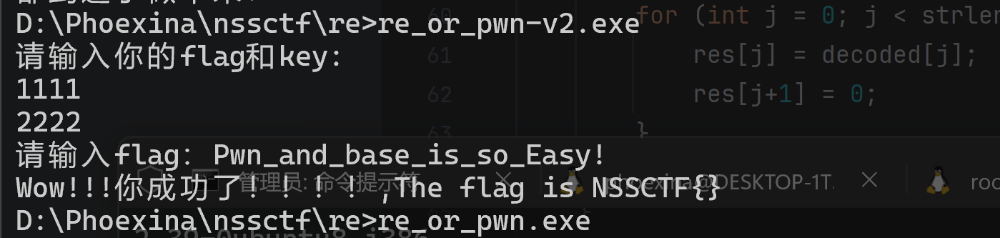

解数字发现，IDA写算式写不明白，一些手动对照后

等一下？好像也没改啊？为什么之前不行后来行了，怀疑人生x

```cpp
int v16 = v9 / 10000; //<=999
int v15 = (v9 % 10000) / 100; // <=9 22
int v14 = v9 % 100; // >9 22
int v13 = 5 * v15 + 114464; //<=99 5 * v15 + 114514 + 16  - 66 144574
int v12 = v9 + 114514 + 176 * (v15 + v14 - 3) - 66; //奇数 v9 + 114514 + 16 * 11 * (v15 + v14 - 3) - 66 //123886
int v11 = (v12 - 16 * v16) + v14 * v13; //21241824
printf("v9=%x v12=%x v13=%x v14=%x v15=%x v16=%d v11=%d\n", v9, v12, v13, v14, v15, v16, v11);
```

算了不管了，放一下Python的z3

```python
from z3 import *

# 创建 Z3 变量
v9 = Int('v9')
v12 = Int('v12')
v13 = Int('v13')
v14 = Int('v14')
v15 = Int('v15')
v16 = Int('v16')
# 创建约束
s = Solver()
#s.add(v16 <= 999)
s.add(v16 == v9 / 10000)
s.add(v15 == v9 % 10000 / 100)
#s.add(v15 <= 9)
s.add(v14 == v9 % 100)
s.add(v14 <= 9)
#s.add(v13 <= 99)
s.add(v13 == 5 * v15 + 114514 + 16 - 66)
s.add(v12 == v9 + 114514 + 16 * 11 * (v15 + v14 - 3) - 66)
s.add(21241824 == v12 - 16 * v16 + v14 * v13)
#s.add(v12 % 2 != 0)

# 求解
if s.check() == sat:
    model = s.model()
    print("解为:")
    num9 = model[v9].as_long()  # 将 Z3 数值转换为十进制字符串
    print(f'v9 = {num9}')  # 打印数值
else:
    print("没有找到可行解")
```

总之就解出来数字是20241008

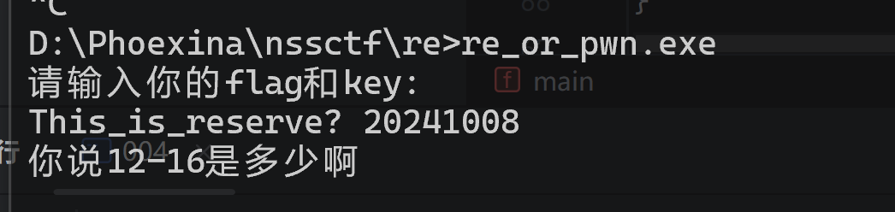

于是就是怎么组合的问题了，仔细看了一下


发现这里有一个栈溢出，a1受我们控制，而且可以输入300个字符，end只有12位

或者说我们输入16位的字符串就是在溢出了

12 + 4已经覆盖了ebp，那么再往后写4个就是ret了

那个未被调用的函数是00402463调用的，构造一下

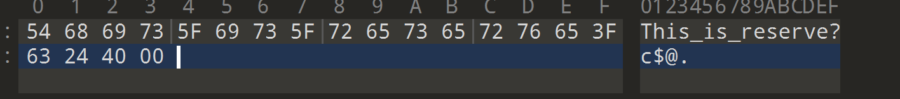


于是觉得这个肯定是对的，去提交了flag，还是不对

怀疑人生了（

和出题人聊了一下，栈溢出的地址是不唯一的！好吧

其实就是地址偏移一位，是下面那个（）

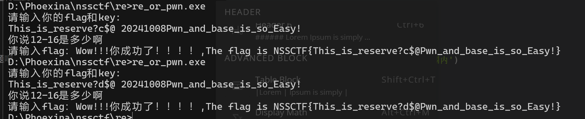

微妙（）

### 3.2 md5也能爆破？

还没做，以后做了再说
