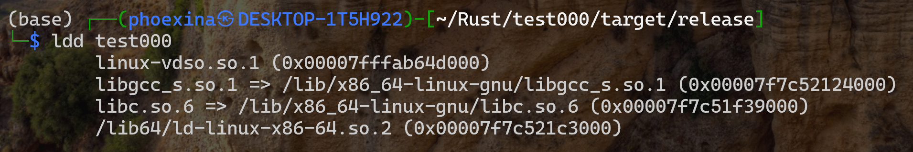
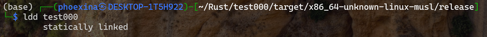
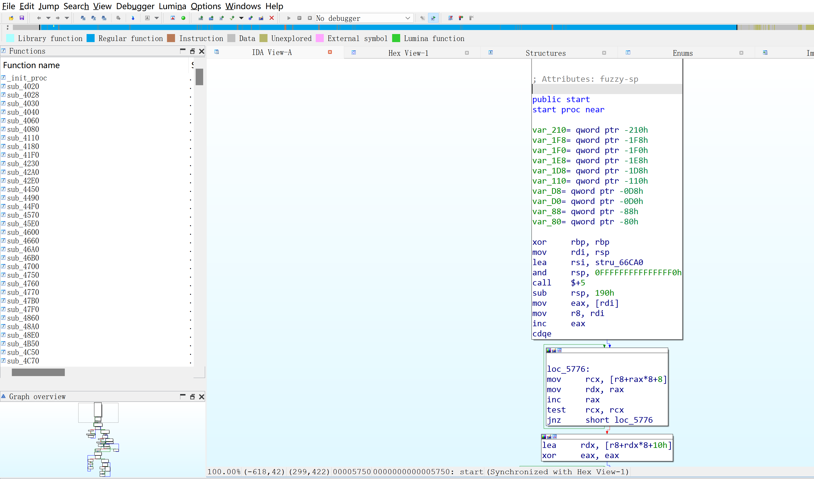
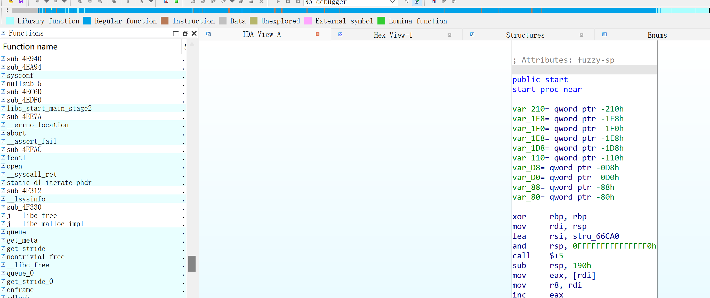

# Rust逆向

---

## 1 编译一个静态链接的程序

试图配置clion的rust插件或者是rustrover，但好像没有成熟的破解

放弃了，还是用vscode

插件使用rust-analyzer 和 Code Runner

但Code Runner直接编译当前rs，不能走cargo

所以还是得cargo编译

src/main.rs

```rust
mod test;

fn main() {
    println!("Hello, world!");
    let result = test::test(5, 10); // 调用 test.rs 中的 test 函数  
    println!("The result is: {}", result); 
}
```

src/test.rs

```rust
pub fn test(a: i32, b: i32) -> i32 {  
    return a + b;  
}
```

Cargo.toml

```toml
[package]
name = "test000"
version = "0.1.0"
edition = "2021"

[profile.release]   
strip = "symbols" 

[dependencies]
```

编译命令

```shell
rustup target add x86_64-unknown-linux-musl
cargo build --release --target x86_64-unknown-linux-musl
```

直接release是动态链接的



加上x86_64-unknown-linux-musl才是静态的



strip=symbols会去掉所有符号

## 2 IDA分析

### 2.1 创建sig导入

直接放入IDA的状态，完全看不懂了



经查找，在`~/.rustup/toolchains/stable-x86_64-unknown-linux-gnu/lib/rustlib/x86_64-unknown-linux-musl/lib`下面有很多静态库

尝试制作FLIRT签名文件

```shell
./pelf /home/phoexina/.rustup/toolchains/stable-x86_64-unknown-linux-gnu/lib/rustlib/x86_64-unknown-linux-musl/lib/libcore-1beae5247ead4ed1.rlib 1.pat

./sigmake ./1.pat 1.sig
gedit 1.exc
#删除前面的所有注释，再次运行
./sigmake ./1.pat 1.sig
```

导入了libc.a和core.rlib的效果



看起来有用，继续尝试
## 3 

测试表格
